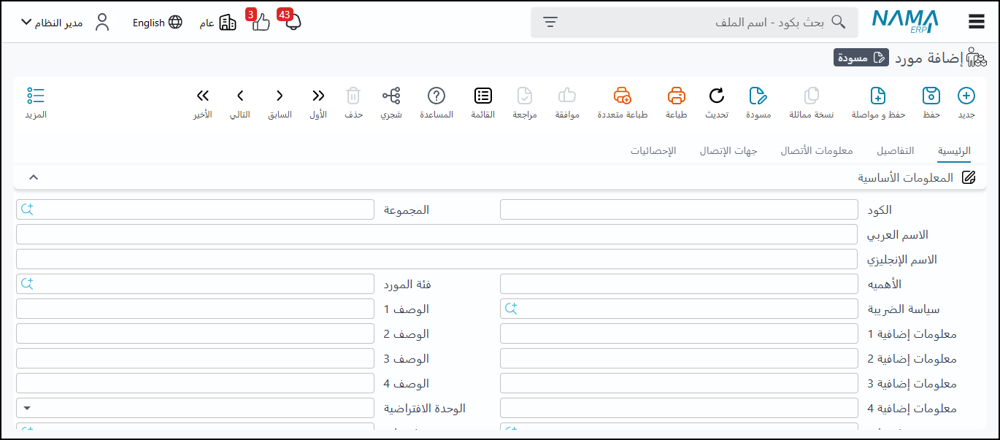
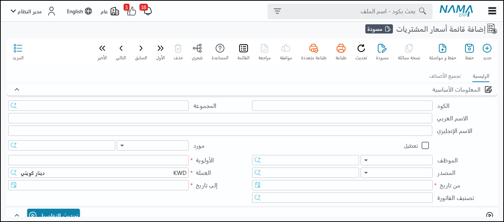
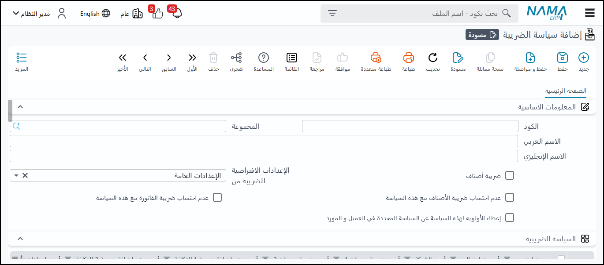
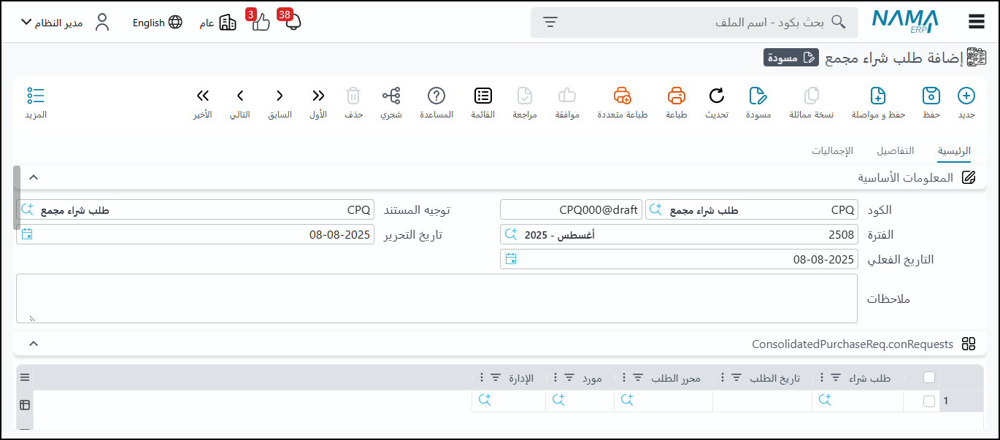
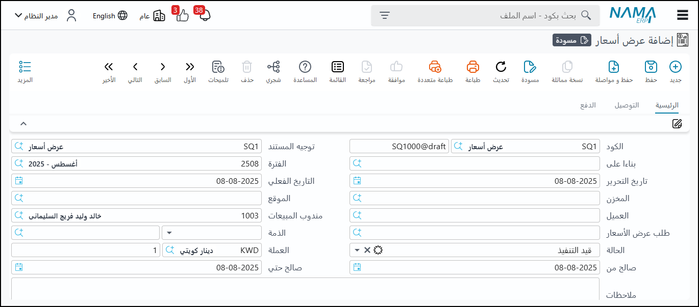
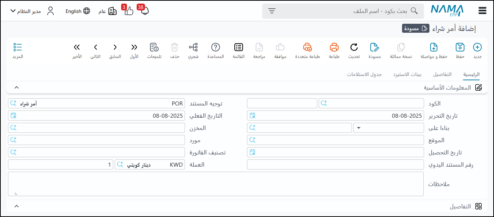
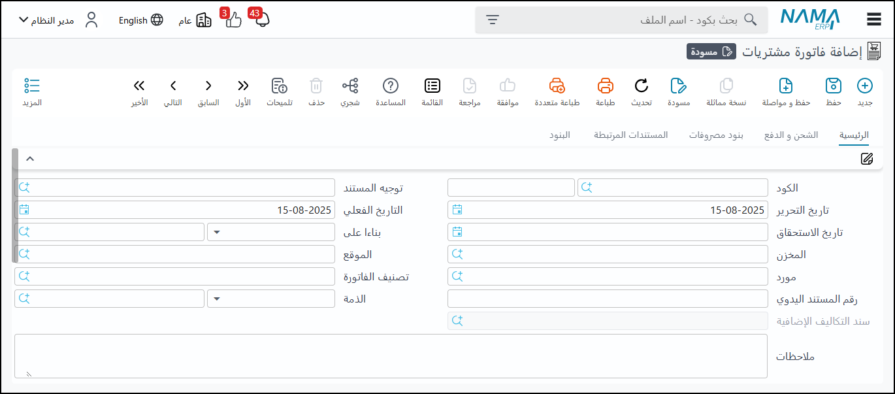

<rtl>

# مقدمة

تعتبر عملية الشراء ركيزة أساسية لأي عمل تجاري، ولكن إدارتها يدويًا قد يكون مرهقًا ومعقدًا.
يأتي نظام نما سوفت للمشتريات ليُحدث ثورة في هذه العملية، حيث يتيح لك إدارة جميع جوانب المشتريات بكفاءة عالية، بدءًا من طلبات الشراء وحتى استلام الفواتير

بفضل واجهته سهلة الاستخدام وميزاته المتقدمة، يُمكنك نظام نما سوفت من أتمتة المهام الروتينية، تتبع حالة الطلبات بدقة، وتحليل بيانات المشتريات لاتخاذ قرارات أفضل. 
إنه الحل الأمثل لضمان الشفافية، تقليل التكاليف، وتحسين العلاقة مع الموردين، مما يجعله شريكك الأساسي لتحقيق النجاح.

## شاشة الموردين

تُعد شاشة "الموردين" أداة متكاملة لإدارة جميع المعلومات المتعلقة بالجهات التي تتعامل معها شركتك. تبدأ الشاشة بجمع البيانات الأساسية للمورد، مثل اسمه ونوعه وتصنيفه، مما يسهّل عملية البحث والفرز.

لضمان إدارة مالية سليمة، تسمح الشاشة بتسجيل كافة التفاصيل المالية في قسم الحسابات، حيث يمكنك تحديد شروط الدفع والحد الائتماني للمورد. 

كما يمكنك إدخال كافة المعلومات الضريبية في تبويب الضرائب، لضمان الالتزام بالمتطلبات القانونية.

ولتوثيق الاتفاقيات بشكل دقيق، توفر الشاشة قسماً مخصصاً لتفاصيل شروط التعاقد، حيث يمكنك تسجيل كل ما يتعلق بشروط الشحن، ومدة التوريد، ومعايير الجودة المتفق عليها.

كما يمكنك الاحتفاظ بجميع بيانات الاتصال الخاصة بالمورد وموظفيه في قسم جهات الاتصال ومعلومات الاتصال.

شاشة الموردين تتعلق بشكل أساسي بالمعلومات المتعلقة بالموردين وأسعار الشراء، ولكنها ليست بنفس تفصيل شاشة العملاء.

## شاشة أسعار المشتريات

تُستخدم لتسجيل وتحديث أسعار شراء المواد من مختلف الموردين.
تتيح تحديد أسعار متعددة لنفس المادة حسب المورد أو الفترة الزمنية أو مواصفات مثل اللون والمقاس.
كما يمكن ربط السعر بوحدة قياس معينة أو تحديده بناءً على حجم الطلب، مع إمكانية تحديد تاريخ بداية ونهاية صلاحية السعر.
توفر هذه الشاشة مرونة كبيرة في إدارة الأسعار ومتابعتها بدقة.

## شاشة سياسات الضريبة

تُستخدم لإعداد وإدارة القواعد الضريبية الخاصة بأنواع الضرائب المختلفة مثل ضريبة القيمة المضافة.
تتيح تحديد النسب الضريبية لكل صنف أو عميل أو مورد، وربط هذه النسب تلقائيًا بالفواتير والمستندات المالية.
كما تتيح مرونة في تطبيق السياسات الضريبية بحسب التشريعات المعمول بها، وتوليد التقارير الضريبية المطلوبة بدقة.

## طلبات الشراء المجمعة

تُستخدم لتجميع طلبات الشراء الصادرة من عدة أقسام أو فروع في طلب مركزي واحد.
تتيح عرض ومراجعة الطلبات حسب القسم أو النوع أو الأولوية، مما يساعد على تقليل عدد أوامر الشراء وتحسين القدرة التفاوضية مع الموردين عند الشراء بكميات أكبر.
تُعد أداة فعالة لترشيد التكاليف وتوحيد العمليات الشرائية.

## شاشة عروض الأسعار

تُستخدم لإدخال ومقارنة عروض الأسعار المقدمة من الموردين.
تسمح بإدخال تفاصيل كل عرض مثل السعر، الكمية، شروط الدفع، مدة التسليم، وصلاحية العرض.
تحتوي على أدوات مقارنة ذكية تساعد في تقييم العروض بناءً على معايير محددة، كما تدعم إرفاق مستندات العروض وإرسال طلبات العروض مباشرة من النظام.

## شاشة أوامر الشراء

تُستخدم لإصدار أوامر الشراء الرسمية التي تحتوي على كافة تفاصيل المواد المطلوبة من الموردين.
ترتبط مباشرة بحسابات الموردين وسجلاتهم، وتتيح متابعة حالة كل أمر سواء كان قيد التنفيذ أو مكتمل أو ملغي.
يمكن من خلالها طباعة الأمر أو إرساله إلكترونيًا، مع إمكانية ربطه بإيصالات التوريد وتحديث المخزون تلقائيًا.

## شاشة فواتير المشتريات

تُعد شاشة فواتير المشتريات أحد العناصر الأساسية في الأنظمة المحاسبية والمخزنية، حيث تُستخدم لتسجيل وتوثيق عمليات الشراء من الموردين بشكل منظم. 

تعمل هذه الشاشة كمركز تحكم لإدارة كافة تفاصيل الفواتير الواردة، بدءًا من البيانات الأساسية وحتى المستندات المرفقة، وترتبط مباشرة بحسابات الموردين والمخزون والضرائب.

يمكنك استخدام الشاشة في تنفيذ المهام الرئيسية التالية:

إدخال فواتير المشتريات وتحديثها مع كافة التفاصيل المالية والمخزنية.
ربط الفواتير بحركات المخزون (تحديث الكميات تلقائيًا عند التأكيد).
تسهيل متابعة المدفوعات والالتزامات تجاه الموردين.
إرفاق المستندات الداعمة (مثل نسخ الفواتير الورقية أو أوامر الشراء).
التكامل مع الحسابات المالية (المصاريف، الضرائب، حسابات الدفع).

مثال عملي

لنفترض أن شركتك اشترت بضاعة بقيمة 50,000 ريال من مورد "س".
قيمة البضاعة: 50,000 ريال.
ضريبة القيمة المضافة (15%): 7,500 ريال.
مصاريف شحن: 500 ريال.
تم الدفع 5,000 ريال نقدًا، والباقي على الحساب.

القيد المحاسبي سيكون كالتالي:

من مذكورين:
50,000 حـ/ المشتريات
7,500 حـ/ ضريبة القيمة المضافة للمدخلات
500 حـ/ مصاريف الشحن

إلى مذكورين:
5,000 حـ/ الصندوق (الدفع النقدي)
53,000 حـ/ الموردين (المبلغ المتبقي على الحساب)

## الخصومات (Discounts)
* أنواع الخصومات: يدعم النظام افتراضياً ثمانية خصومات (من خصم 1 إلى خصم 8) بالإضافة إلى خصم تاسع يمكن تطبيقه في نهاية العام.
* آلية التطبيق:
يتم حساب الخصومات بشكل تسلسلي؛ فمثلاً، خصم 2 يُطبق على صافي القيمة بعد خصم 1.
يُطبق الخصم الموجود في رأس الفاتورة على القيمة الإجمالية للفاتورة بعد تطبيق خصومات البنود.

* التحكم في الخصومات:
يمكن التحكم بشكل كامل في كيفية حساب الخصومات وتحديد أي خصم يُطبق قبل الآخر أو على أي صافي قيمة.
يمكن تحديد ما إذا كان الخصم يؤثر على التكلفة أم لا من خلال الإعدادات.

* تعديل الخصومات بأثر رجعي:
تعديل الخصومات: تتيح هذه الميزة تعديل الخصومات على فواتير الشراء التي أُنشئت في فترات سابقة، مما يؤثر على التوريدات والمبيعات والتكاليف والقوائم المالية بأثر رجعي تُعد هذه الميزة مفيدة للموردين الذين يقدمون حوافز بأثر رجعي، ولكن يجب استخدامها بحذر شديد مع مراعاة الفترات المالية المقفلة.

تعديل سندات الشراء: هي طريقة أبسط لتعديل نسب خصم معينة في فواتير محددة بدلاً من المرور على كل فاتورة يدوياً.

  
الضرائب (Taxes)
أنواع الضرائب: يوجد أربعة أنواع من الضرائب في النظام: اثنان مرتبطان بالصنف (ضريبة أصناف 1 و 2) واثنان مرتبطان بتوجيه الفاتورة (ضريبة 3 و 4).
أساس الحساب: عادةً ما تُحسب جميع الضرائب من الصافي بعد الخصومات.
الضرائب التي لا تؤثر على التكلفة:
 ضريبة القيمة المضافة (VAT): في سياق التجارة، لا تؤثر هذه الضريبة عادةً على تكلفة البضاعة المباعة لأنها تُسترد من المستهلك النهائي.
ضريبة الخصم (Withholding Tax): هذه الضريبة لا تؤثر أيضاً على التكلفة، حيث إنها تُخصم من المورد وتُسدد لمصلحة الضرائب باسم المورد.
* التحكم في الضرائب: يمكن ضبط إعدادات النظام للتحكم في كيفية حساب كل ضريبة، وما إذا كانت تؤثر على التكلفة أم لا، وترتيب تطبيقها.

* تاريخ صلاحية الضرائب: يمكن تحديد نسب الضرائب بفترات زمنية (من تاريخ إلى تاريخ) لاستيعاب التغيرات في القوانين الضريبية (مثلاً، تغير ضريبة القيمة المضافة في السعودية من 5% إلى 15%)
* تأثير الضرائب على المرتجعات: عند عمل مرتجع، تُحسب الضريبة عادةً بالقيمة أو النسبة الحالية المطبقة في تاريخ إنشاء المرتجع، وليس بالقيمة التاريخية للفاتورة الأصلية، خاصة بالنسبة لضريبة القيمة المضافة.

## مرتجعات المشتريات
* إنشاء المرتجع: يمكن إنشاء مرتجع المشتريات بناءً على فاتورة شراء موجودة، أو بشكل مستقل. يمكن أيضاً إجبار المستخدم على ربط المرتجع بفاتورة.
* الأسعار والخصومات: يقوم النظام بسحب الأسعار والخصومات من الفاتورة الأصلية تلقائياً، ولكن يمكن تعديلها إذا كانت الصلاحيات تسمح بذلك.
* 
* معالجة التكلفة:
إذا كان متوسط تكلفة الصنف الحالي في المخزن يختلف عن سعر شرائه الأصلي في فاتورة المرتجع، فإن النظام يصرف الصنف من المخزن بتكلفته الحالية (المتوسطة).
يمكن استخدام حساب وسيط يُسمى "فرق مردودات المشتريات" لتسجيل الفروقات بين سعر المرتجع وتكلفة الصرف المخزني، مما يضمن دقة القيود المحاسبية.

* التأثير على الإعدادات: لا يحتفظ النظام بتاريخ تعديلات إعدادات الضرائب والخصومات. لذا، عند إنشاء المرتجع، سيُطبق الإعدادات الحالية المعرفة في النظام في تاريخ إنشاء المرتجع. ومع ذلك، بالنسبة لضرائب ذات فترات صلاحية تاريخية، سيتم تطبيق النسبة المطبقة في تاريخ إنشاء المرتجع

## الاعتمادات المستندية (Documentary Credits)
يُعد كلاهما أداتين لحساب التكلفة الفعلية للبضاعة، لكنهما يخدمان سيناريوهات عمل مختلفة.
أ. الاعتمادات المستندية (Documentary Credits)
* الهدف: إدارة عمليات الاستيراد من خلال البنوك لضمان المعاملات بين المستوردين والمصدرين، وتضمين التكاليف الإضافية (مثل الجمارك والمصاريف الأخرى) في تكلفة البضاعة.
* البيانات الأساسية: تتضمن بيانات هامة مثل الحساب البنكي، معلومات الشحن (ميناء الشحن والوصول، طريقة الشحن)، العملة، قيمة الاعتماد، مبلغ التغطية، العمولة، والمصاريف الأخرى.
* الشحنات المتعددة: يمكن أن يتضمن الاعتماد الواحد عدة شحنات، حيث يمكن لكل شحنة أن يكون لها تكاليفها ومعالجتها المستقلة.
* بنود المصروفات: يُعرّف ملف "بنود المصروفات" كيفية توزيع هذه التكاليف على الأصناف (مثل التوزيع حسب القيمة، الكمية، الحجم، أو يدوياً).
* الفاتورة المبدئية (Proforma Invoice): وثيقة تحدد الأصناف، الكميات، والسعر المخطط للاستيراد، وتُستخدم كأساس لتوزيع المصاريف اللاحقة.
* دورة عمل الاعتماد المستندي:
    1. (اختياري) طلب اعتماد: طلب داخلي في الشركة.
    2. (اختياري) طلب فتح اعتماد للبنك: طلب للبنك لفتح الاعتماد.
    3. فتح اعتماد: خطوة إجبارية لبدء الاعتماد، وتؤثر محاسبياً بتسجيل الدفعات المقدمة والعمولات.
    4. سند المصروف (LC Expense Document): لتسجيل المصاريف المختلفة (مثل الجمارك، النقل) الخاصة بالاعتماد. يمكن توزيعه تلقائياً أو يدوياً على الأصناف. يمكن أن يغطي سند المصروف الواحد مصاريف لعدة اعتمادات.
    6. الإجراءات (Procedures): لتسجيل الملاحظات الهامة أو الأحداث التي تحدث على الاعتماد (مثل وصول البضاعة أو مشاكل الجمارك).
    7. سند التوريد المخزني: يتم توريد البضاعة إلى المخزن، ويتم ربطها بالاعتماد. يتم احتساب تكلفة مؤقتة للبضاعة حتى يتم إغلاق الاعتماد.
    8. تكليف الاعتماد/الشحنة (LC Costing): الخطوة النهائية التي تقوم بحساب التكلفة الفعلية والنهائية للاعتماد أو لشحنة محددة، مما يغلق الحسابات الوسيطة ويثبت التكلفة النهائية للمخزون.

تكاليف الاستلام الإضافية (Additional Receipt Costs)
* الهدف: إضافة تكاليف إضافية على بضاعة تم شراؤها محلياً أو من موردين لا يتطلبون اعتماداً مستندياً. هذه التكاليف لا تخص المورد الأصلي للبضاعة.
* المرونة: يمكن أن تكون هذه التكاليف موجبة (تزيد التكلفة) أو سالبة (تقلل التكلفة)، ويمكن تحديد ما إذا كانت تؤثر على التكلفة الكلية أم لا.
* استخدامات رئيسية:
    1. الشراء المباشر: إضافة مصاريف مثل الجمارك أو التعبئة والتغليف على فواتير الشراء المباشرة.
    2. التجميع البسيط: إضافة تكاليف العمالة أو الخدمات الخارجية (التي تتم خارج الشركة) إلى تكلفة المنتجات المجمعة.
    3. تحويل المخزون: إضافة تكاليف نقل البضاعة بين المستودعات إلى تكلفة الصنف، خاصة عندما تكون تكاليف النقل كبيرة وتؤثر على ربحية المبيعات.
ملاحظة هامة: على الرغم من أن الاعتمادات المستندية وتكاليف الاستلام الإضافية تخدمان أغراضاً مختلفة في دورة العمل، إلا أنهما يشتركان في نفس الكود والآلية الداخلية لتوزيع المصاريف وحساب التكلفة النهائية. النظام مصمم بمرونة عالية لاستيعاب احتياجات العمل المختلفة.

</rtl>

