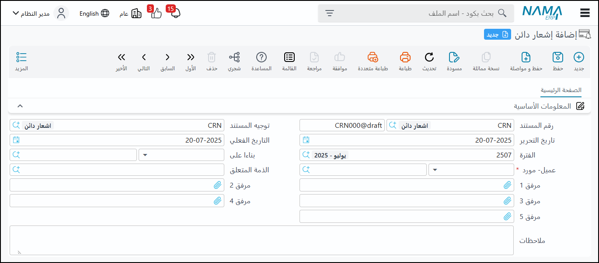

<rtl>

# نظام الحسابات

## شجرة الحسابات

يتم تقسيمها إلى مستويين:
- **المستوى الأول**: لا تجرى عليه حركات (مثل الأصول، الأصول المتداولة)
- **المستوى الأخير**: تجرى عليه الحركات (مثل حسابات الصناديق، البنوك، العملاء، الموردين)

يمكن عرض دليل الحسابات بشكل شجري للمراجعة.

### شجرة المدين وشجرة الدائن
يمتاز النظام بوجود **شجرتين للحسابات**: شجرة للمدينين وشجرة للدائنين. على الرغم من أن معظم الحسابات تكون في الشجرتين بنفس الشكل، إلا أن بعض الحسابات (مثل العملاء والموردين) يمكن أن يتغير مكان عرضها في التقارير والقوائم (تحت المدينون أو الدائنون) بناءً على رصيدها الحالي.

### العملة والموازنات
يتم تحديد **العملة الأساسية** للحساب. يمكن أيضاً تحديد ما إذا كان الحساب مرتبطاً بموازنة وما إذا كان يمكن تجاوز هذه الموازنة.

### أنواع الشجرة (Chart Types)
يدعم النظام تعريف أنواع مختلفة من شجرات الحسابات (مثل شجرة تجارية، شجرة صناعية). يمكن استخدام شجرة حسابات واحدة لعدة شركات أو شجرات منفصلة لكل شركة.

> **التوصية**: استخدام شجرة واحدة لجميع الشركات للسماح بإصدار قوائم مالية مجمعة بسهولة. استخدام شجرات منفصلة يتطلب تجميع البيانات باستخدام الأكواد، مما قد يسبب مشاكل إذا اختلفت الأكواد أو كانت مكررة.

### تكرار أكواد الحسابات/الكيانات (Repeating Codes)
يسمح النظام بتكرار نفس الكود (الكود الذي يراه المستخدم) لأكثر من حساب أو كيان (مثل صنف أو عميل أو مورد) عبر شركات مختلفة.

**السبب**: النظام يعتمد داخلياً على **معرف فريد داخلي (Internal ID)** لكل سجل، وليس على الكود الذي قد يغيره المستخدم. 

> **تحذير**: على الرغم من أن هذه الإمكانية متاحة (وموجودة في شركات تستخدم النظام)، إلا أنها قد تسبب التباساً للمستخدم عند البحث إذا تكرر الكود في أكثر من شركة.

**التوصية**: يُفضل عدم تكرار أكواد الكيانات التي ستتعامل مع أكثر من شركة (مثل العملاء أو الموردين) لضمان:
- تجميع بياناتها بشكل صحيح
- رؤية رصيدها الإجمالي عبر الشركات في التقارير المجمعة
- تجنب مشاكل مثل السماح لعميل برصيد مستحق في شركة بمغادرة سيارته من شركة أخرى تابعة لنفس المجموعة

## سند القيد

**الوظيفة الأساسية**: هو المستند الأساسي لإدخال القيود المحاسبية.

### المحددات (Dimensions)
يتميز النظام بإمكانية ربط سطور القيد بالمحددات. بالإضافة إلى المحددات الإلزامية على مستوى المستند (مثل الشركة)، توجد محددات إضافية (مثل القطاع والفرع).

**الأهم**: وجود محدد إضافي على مستوى السطر يسمى **"السجل" (Record)**، والذي يمكن استخدامه لربط القيد بكيان معين في النظام، مثل:
- مشروع معين في المقاولات
- سيارة
- مركز تكلفة

هذا يسهل تحليل البيانات المحاسبية على مستوى هذه الكيانات.

### أسعار الصرف
يتم حساب معدل سعر الصرف **تلقائياً** إذا تم تسجيل المستند بعملة أجنبية، بناءً على أسعار الصرف المعرفة مسبقاً في النظام.

### إدخال القيم
يتم إدخال المبلغ في جانب **المدين** أو **الدائن** على مستوى السطر.

## سندات القبض والصرف

### الغرض والفوائد
على الرغم من أن أي حركة مالية يمكن تسجيلها كسند قيد، فإن استخدام سندات القبض والصرف يضيف **"معنى"** للحركة ويسهل تتبعها وتحليلها.

**مثال**: يسهل معرفة متى دفع العميل مبلغاً معيناً بتتبع سندات القبض بدلاً من البحث في جميع قيود اليومية.

### ارتباطها بالقيود
في النهاية، كل سند قبض أو صرف يؤدي إلى إنشاء قيد محاسبي في الخلفية.

### التفاصيل والميزات

**الذمة المتعلقة**: يمكن ربط سند القبض أو الصرف بكيان معين مثل عميل أو مورد.

**ارتباطها بالفواتير**: هذه من الوظائف الرئيسية، حيث يمكن ربط سند القبض أو الصرف بفاتورة بيع أو شراء معينة. هذا الارتباط ضروري لتقارير **أعمار الديون (Aging Reports)**، والتي توضح المدة التي مر عليها رصيد كل عميل أو مورد.

يمكن للمستخدم:
- **تسوية الفواتير يدوياً** باختيار الفواتير المراد تسويتها وتحديد المبلغ الذي سيتم تسديده لكل فاتورة
- يمكن للنظام أيضاً القيام بالتسوية **تلقائياً** بناءً على مبدأ **(First In, First Out)**

**الأوراق التجارية**: تدعم سندات القبض والصرف التعامل مع الأوراق التجارية مثل الشيكات (تحت اسم **"أوراق قبض"** و**"أوراق صرف"** أو **"واردة وصادرة"** في النظام)، هذه الأوراق لها **دورة حياة كاملة** يتم تتبعها في النظام.

الدفعات: هذه الميزة مهمة في عقود البيع والشراء التي تتضمن أقساط أو دفعات مجدولة (مثل عقود الاستثمار العقاري أو شركات التقسيط). في سند القبض أو الصرف، يمكن ربط الحركة بدفعة معينة من عقد أو فاتورة متضمنة جدول دفعات. يقوم النظام بتحديث المبلغ "المحصل نظامياً" والمبلغ "المتبقي" تلقائياً عند ربط سند القبض/الصرف بالدفعة.

الكميات والقيم: في سند الصرف (خاصة)، يمكن إدخال الكمية وسعر الوحدة والضريبة لحساب القيمة الإجمالية، مما يسهل تسجيل المصروفات المرتبطة بكميات (مثل مصروفات نقل محسوبة بالكمية).

ملحوظة:
▪ سند القبض: إذا تم إنشاؤه بناءً على فاتورة مبيعات، فإنه يؤثر في المبلغ المتبقي من الفاتورة ويرتبط بها تلقائيًا.
▪ سند الصرف: يُعد عادةً بناءً على فاتورة مشتريات.

## أسعار الصرف

**التعريف**: يتم تسجيل أسعار الشراء والبيع للعملات الأجنبية مقابل العملة الأساسية للنظام.

**الاستخدام**: يستخدم النظام أسعار الصرف المسجلة **تلقائياً** عند التعامل بمستندات أو حسابات بعملة أجنبية، بناءً على تاريخ المستند.

## إشعارات المدين والدائن

**الغرض**: تستخدم لتعديل أرصدة العملاء أو الموردين أو أي حساب آخر.

**الميزات**: يمكن ربط الإشعار بالفواتير، ويمكن حساب المبلغ المطلوب كنسبة مئوية من قيم الفواتير المحددة.

## إشعار مدين

**شرح الاستخدام**: يستخدم كبديل لسند القبض، ويؤثر في المتبقي من فاتورة المبيعات.

### الفرق بين إشعار المدين وسند القبض
يواجه بعض المستخدمين صعوبة في التمييز بينه وبين سند القبض، إذاً ما الفرق بينهما؟

**سند القبض**: مستند له تأثير فعلي في النظام المحاسبي، عند إنشاء سند قبض بناءً على فاتورة مبيعات، فإنه يؤثر مباشرةً في المبلغ المتبقي من الفاتورة ويربط نفسه بها.

> **ملاحظة**: لا يؤثر سند القبض على المبلغ المتبقي من فاتورة المشتريات؛ لأن فاتورة المشتريات عادةً ما يتوجب عليها سند صرف.

**إشعار المدين**: يُعد إشعار المدين بديلاً لسند القبض أو سند الصرف، ويمكن التحكم في كيفية معالجته (سواء كقبض أو صرف) في تأثيره على المبلغ المتبقي عبر خاصية **"التوجيه"** في النظام، ويؤثر إشعار المدين في فاتورة المبيعات إذا تم إنشاؤه بناءً عليها

إشعار المدين: عند إنشائه بناءً على فاتورة مبيعات، يؤثر فيها.
يسمح النظام بتحديد كيفية تأثير هذه الإشعارات (سواء كـ "قبض" أو "صرف") على رصيد الفاتورة المتبقي من خلال خاصية "التوجيه".

الاستخدام الشائع في مصر: تستخدم هذه الإشعارات غالبًا لتسجيل ضريبة الخصم (مثل 1%، 3%، 5% حسب نوع النشاط)، حيث يمكن إدخال قيمة الفاتورة واختيار نسبة الخصم.

تؤثر هذه الإشعارات أيضًا في أعمار الديون.

ملحوظة: يمكن استخدامه للعمل على أكثر من فاتورة في نفس الوقت، حيث يجمع النظام إجمالي قيم الفواتير.

## إشعار دائن

شرح الاستخدام: يستخدم كبديل لسند الصرف، ويؤثر في المتبقي من فاتورة المشتريات، ومفهومه مشابه لاشعار المدين من حيث الارتباك في استخدامه.

يمكن التحكم في تأثيره من خلال التوجيه ليعامل معاملة الصرف أو القبض.

يحتوي على نفس وظائف اشعار المدين فيما يتعلق بضريبة الخصم والتعامل مع فواتير متعددة.

إشعار الدائن: عند إنشائه بناءً على فاتورة مشتريات، يؤثر فيها.

بشكل عام، فإن الإشعارات الدائنة والمدينة توفر مرونة في التعامل مع العمليات المحاسبية وخاصة في تسجيل الخصومات والضرائب، مع إمكانية تحديد تأثيرها على الفواتير وأعمار الديون من خلال التوجيه.

## سند التحويل البنكي

**الغرض**: لتسجيل التحويلات البنكية، سواء كانت تحصيل أم دفع، ويتشابه بشكل كبير مع سند القبض والصرف.

### خيارات الاستخدام
- بعض المستخدمين يستخدمونه **للتحصيل فقط**
- آخرون **للدفع فقط**
- بعضهم **للنشاطين معاً**

يمكن استخدامه لتحصيل الأموال أو دفعها، أو كليهما، ويمكن للمستخدم تحديد طبيعته (**قبض** أو **صرف**) من خلال **التوجيه** الخاص به.

## أسعار الصرف

**الغرض**: لتسجيل وتحديث أسعار الصرف للعملات المختلفة في النظام، ويمكن تسجيل **سعر الشراء** و**سعر البيع** للعملات.

يوجد حقل لـ **"السعر المكافئ"** وهو مقلوب الرقم، وهو مجرد معلومة إحصائية.

### أنواع السجل لسعر الصرف
- **سنوي**: لسنة كاملة
- **فتري**: لفترة مالية معينة (مثل يناير، فبراير)
- **من تاريخ لتاريخ**: لفترة زمنية محددة
- **يومي**: ليوم واحد

### أولوية البحث عن سعر الصرف
يتم البحث أولاً عن السعر **اليومي**، ثم **"من تاريخ لتاريخ"**، ثم **الفتري**، ثم **السنوي**.

> **ملاحظة**: لا يتم تعديل أسعار الصرف تلقائياً؛ يجب إنشاء مستند جديد لكل فترة أو يوم إذا تغير السعر.

### نقاط مهمة
- عند إنشاء فاتورة، يقوم النظام بالبحث عن سعر الصرف للعملة في تاريخ الفاتورة بناءً على أولوية البحث المذكورة
- يمكن للمستخدم تغيير سعر الصرف الافتراضي يدوياً عند تسجيل المعاملة إذا لزم الأمر
- يجب ضبط أسعار الصرف قبل القيام بأي عملية مالية ذات صلة

## جاري تحويل الشركات

**الغرض**: لتمكين التحويلات المالية بين الشركات المختلفة داخل نفس النظام، مما يضمن توازن القيود المحاسبية لكل شركة.

### الآلية
تسمح هذه الشاشة بإنشاء **مستند واحد** له تأثير **قيدين** (قيد لكل شركة) لضمان توازن ميزان كل شركة على حدة.

### مثال على التحويل
عند تحويل مبلغ من خزينة شركة (1) إلى خزينة شركة (2):

**في شركة (1) (المصدر)**: يكون القيد من حساب **"جاري الشركة اثنين"** إلى **"خزينة شركة واحد"**

**في شركة (2) (الوجهة)**: يكون القيد من **"خزينة شركة اثنين"** إلى **"جاري شركة واحد"**

تُستخدم حسابات **"جاري الشركة"** كحسابات وسيطة تصفّر بعضها البعض.

### المرونة في الاستخدام
هذا المستند يسمح باختيار الشركات على السطور وينشئ القيود تلقائياً.

> **توسع المفهوم**: العملية ليست مقتصرة على الأموال فقط؛ فكرة "جاري تحويل الشركات" تمتد لتشمل نقل الأصول (باستخدام سند نقل أصل) وتحويل المخزون (باستخدام سند التحويل المخزني) بين الشركات، بنفس المفهوم المحاسبي.

## طلبات القبض والصرف

### طلب القبض
**الغرض**: يستخدم لتسجيل طلبات استلام المبالغ المالية من قبل الأشخاص الذين ليس لديهم صلاحيات محاسبية مباشرة.

**الميزات**:
- يسمح للموظف بإدخال بنود المبلغ المستلم
- يرسل تنبيهاً للمسؤول عن الحسابات لتسجيل المبلغ

### طلب الصرف
**الغرض**: يستخدم للموظفين لطلب صرف مبالغ مالية، خاصة في حالات **العهد** أو **المصاريف**.

**الميزات**:
- يسمح للموظف بتحديد البنود التي يرغب في صرفها ولمن سيتم الصرف ومن أي خزينة
- يرسل تنبيهاً للمسؤول عن الصرف للموافقة على المبلغ

## أوامر قبض

**الوصف**: هو مستند شبيه بسند القبض ولكنه **بدون تأثير فعلي** على الحسابات، يُستخدم لتهيئة البيانات أو كأمر تنفيذي.

### حالات الاستخدام
- يُستخدم بواسطة **المحاسبين المبتدئين** لتجهيز البيانات ليراجعها محاسب آخر وينشئ بناءً عليها سند القبض الفعلي
- يمكن للمحاسب إعداد أمر القبض، ويقوم **أمين الخزينة** بالصرف بناءً عليه، مع التأكد من المبلغ دون الحاجة للتعامل مع التفاصيل المحاسبية الكاملة
- يمكن استخدامه كـ **"بناء على"** لإنشاء سند قبض، حيث يقوم بتنزيل الحسابات والقيد المحاسبي بالكامل والفواتير وأعمار الديون تلقائياً

## أوامر صرف

**الوصف**: مستند شبيه بسند الصرف ولكنه **بدون تأثير فعلي**، يُستخدم لتهيئة البيانات أو كأمر تنفيذي.

### الآلية
- يعمل بنفس طريقة **أمر القبض** ولكن لعمليات الصرف
- يُستخدم لتهيئة البيانات من قبل محاسب، ثم يتم تنفيذها بواسطة **أمين الخزينة** أو محاسب آخر
- يمكن استخدامه كـ **"بناء على"** لإنشاء سند صرف، مما يسهل عملية إدخال البيانات ويضمن تسجيل القيد المحاسبي بالكامل

## فاتورة المتنوعات

**الغرض**: مصممة للفواتير التي لا تحتوي على أصناف مخزنية أو أصول، مثل مشتريات **المستلزمات المكتبية** أو **الخدمات**.

### الميزات الأساسية
- تسمح بتسجيل **الضرائب** و**الخصومات** المرتبطة بهذه المشتريات/المبيعات
- يمكن تحديد **الحساب المحاسبي** الذي ستؤثر عليه كل بند في الفاتورة، مما يسهل على المحاسبين غير المتخصصين تسجيلها
- **المرونة**: يمكن التحكم في طبيعة الفاتورة لتكون شراء أو بيع من خلال **"التوجيه"**
- تدعم تسجيل **الكميات** و**الأسعار** و**الخصومات** و**الضرائب** على مستوى السطر الواحد
- تحديد **العملة** و**معدل الصرف** لكل سطر بشكل مستقل

### حالات الاستخدام
- **شراء مستلزمات** لا يتم بيعها ولا تتبع في المخزون (مثل جالونات المياه للمكتب)
- **فاتورة مبيعات للشركات الخدمية** التي لا تملك مخزون وتبيع خدمات
- **تنظيم عمليات الشراء أو البيع غير المخزنية** بشكل منفصل

> **ملاحظة**: يمكن تغيير اسم الفاتورة في النظام ليتناسب مع غرض الاستخدام (مثل "فاتورة مبيعات خدمات").

## القيود الختامية

**الغرض**: تُستخدم لإنشاء قيد محاسبي في نهاية السنة المالية لإغلاق حسابات **الإيرادات** و**المصروفات** وترحيل صافي الربح أو الخسارة.

### الآلية
- يقوم النظام بإغلاق حسابات **قائمة الدخل** (الإيرادات والمصروفات) وترحيل الفرق إلى حساب **"أرباح وخسائر"**
- يمكن للنظام إنشاء **"قيد افتتاحي"** للسنة الجديدة بالقيمة المرحلة من الأرباح
- يمكن إجراء الإغلاق على مستوى **"المحددات"** (مثل الفروع)، مما يسمح بحساب وإغلاق ربحية كل فرع على حدة

### القيود والشروط
- يجب أن تتم هذه العملية **مرة واحدة فقط** في السنة، في **"فترة الإغلاق"** التي تكون آخر فترة في السنة المالية
- يقوم النظام بالعديد من **التحققات** قبل إنشاء القيد الختامي، مثل التأكد من عدم وجود حركات مكشوفة أو أصول لم يتم إهلاكها

> **تحذير**: بعد إتمام القيد الختامي وإغلاق السنة، لا يمكن تعديل أو حذف أي مستندات أو قيود تؤثر على تلك الفترة المغلقة (مثل فواتير المبيعات أو سندات القبض والصرف). توجد خيارات لفتح هذه الإمكانيات ولكنها محظورة ومقصورة على عدد قليل جداً من المستخدمين نظراً لخطورتها.

## سند قبض إلكتروني

**الوصف**: تطبيق موبايل للمناديب أو المحصلين لإنشاء سندات قبض إلكترونية من العملاء مباشرةً في الموقع.

### الميزات
- يسمح التطبيق بتسجيل المبلغ (**نقدي**، **شيك**، إلخ)
- يجمع **توقيع العميل** و**المندوب**
- يسجل **الموقع** و**التاريخ** و**الوقت**

### التكامل مع النظام
- تصل هذه البيانات إلى النظام، حيث يمكن للمحاسب تحويل سند القبض الإلكتروني إلى **سند قبض عادي** لإنشاء القيد المحاسبي
- مفيد بشكل خاص للمناديب الذين يعملون بنظام **البيع بالآجل** و**التحصيل في الشارع**

## ملفات تعريف النظام

### شجرة الحسابات
**شجرة الحسابات**: هي **الهيكل الأساسي** للحسابات المالية، تُعد الأساس الذي تُبنى عليه جميع العمليات المالية.

يسمح النظام بتعريف **حساب واحد رئيسي** (مثل "جاري الشركاء"، "العملاء"، "المخزون") في شجرة الحسابات، ثم تعريف تفاصيل الأفراد أو الكيانات (الشركاء، العملاء، المخازن) بشكل منفصل وربطها بهذا الحساب العام. هذا يسمح بتتبع الحركات على مستوى الكيان الفرعي مع الحفاظ على شجرة حسابات منظمة.

### التصنيفات
**تصنيف الحسابات** و**التصنيف الضريبي**: تُستخدم لغرض التصنيف والتقارير.

### الكيانات الأساسية
**الشركاء، الخزن، العملاء، الموردين، المخازن**: يتم تعريفهم ككيانات منفصلة في النظام ويتم ربطهم بحسابات مجمعة في شجرة الحسابات (مثل **"جاري الشركاء"**، **"العملاء"**، **"المخزون"**) بدلاً من إنشاء حساب لكل كيان على حدة، مما يوفر مرونة في إدارة البيانات وتتبع الحركات.

</rtl>
