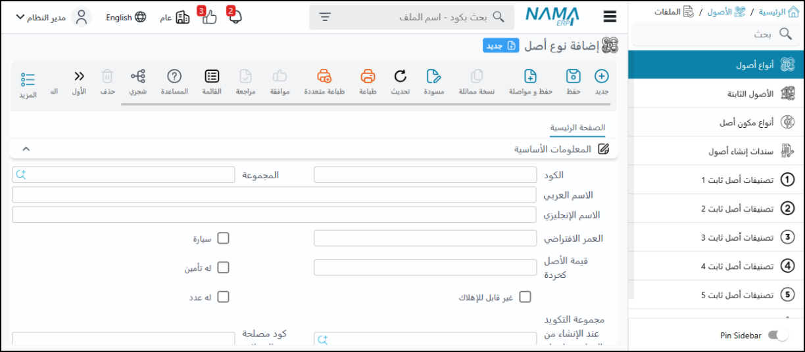
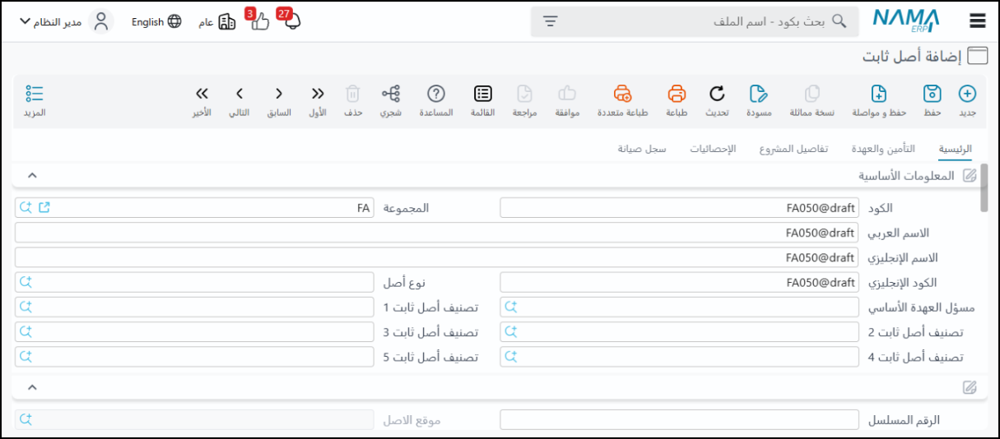
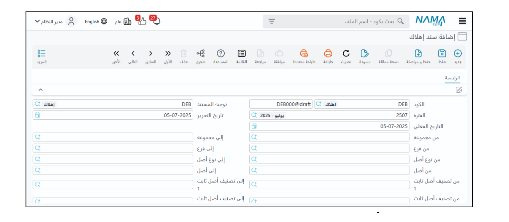
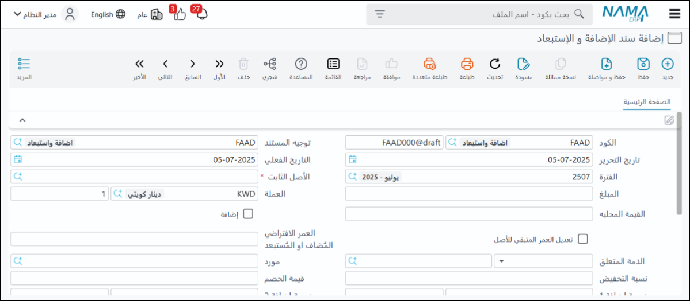
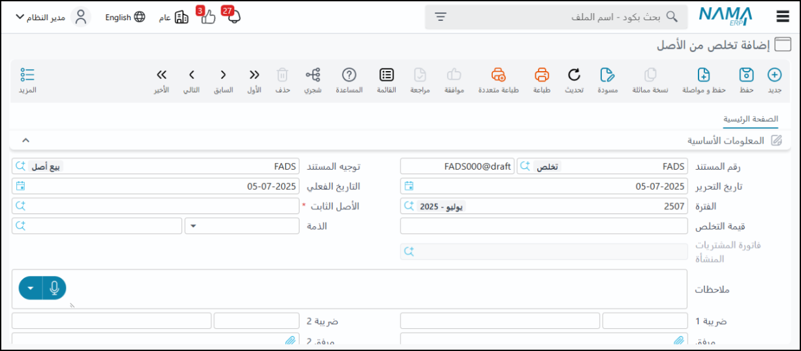
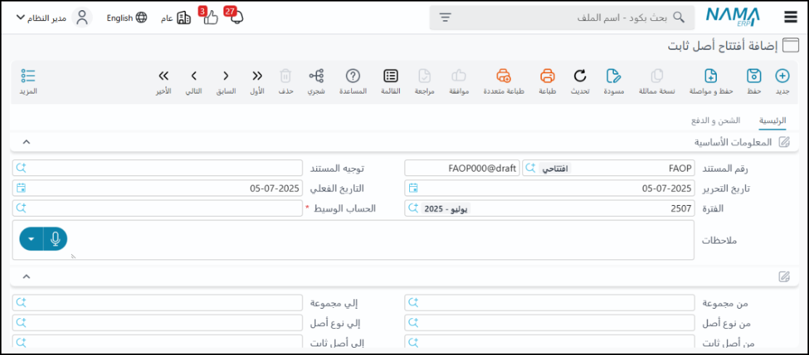
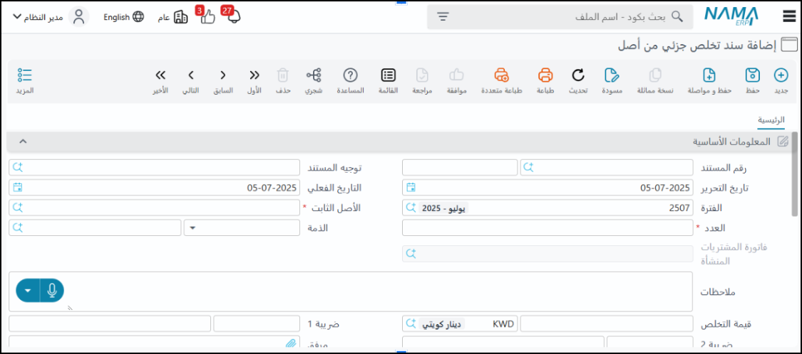
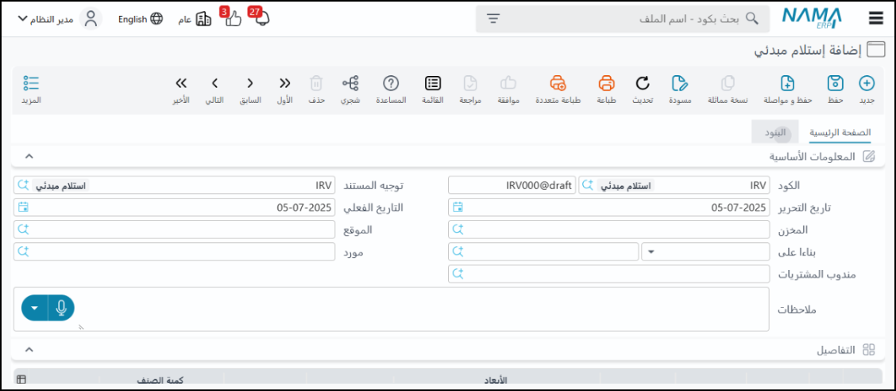

<rtl>

# نظام الأصول الثابتة

## مقدمة

نظام إدارة الأصول في "نما سوفت" هو الركيزة الأساسية لإدارة أصول شركتك بكفاءة وفعالية تامة، بدءًا من لحظة الاقتناء وحتى الاستبعاد النهائي. لقد صُمم هذا النظام ليكون شريكك الاستراتيجي في تحقيق أقصى استفادة من استثماراتك في الأصول الثابتة، من خلال توفير أدوات متقدمة لـ:
التتبع الشامل: مراقبة دقيقة ومفصلة لكافة الأصول على مدار دورتها الحياتية.
لإدارة المُحكمة: تنظيم وتصنيف الأصول بمرونة لتلبية احتياجات عملك الفريدة.
التحليل المالي الدقيق: حساب الإهلاكات وتتبع التكاليف لضمان تقارير مالية شفافة وموثوقة.
تحسين الأداء التشغيلي: جدولة الصيانة وربطها بالأصول لضمان استمرارية وكفاءة العمليات.
دعم اتخاذ القرار: توفير رؤى وتقارير شاملة تمكنك من اتخاذ قرارات مستنيرة ومبنية على بيانات دقيقة.

نظام الأصول يدير دورة حياة الأصول الثابتة من التعريف والشراء إلى الإهلاك والتخلص.

## ملفات تعريف الأصول

◦ أنواع الأصول والتصنيفات: تستخدم لتعريف أنواع الأصول المختلفة وتحديد البيانات والحسابات الافتراضية لكل نوع.
◦ ملف الأصل الثابت نفسه: هو الملف الأساسي لتعريف الأصول الفردية، ويحتوي على معلومات مثل حسابات الأصل، الإهلاك، الإهلاك التراكمي، مصاريف الصيانة، العهدة، والمشاريع.
◦ سند إنشاء أصول: مستند اختياري يسمح بإنشاء سجلات الأصول مسبقًا في النظام قبل شرائها فعليًا، وهذا مفيد في بعض دورات العمل.
◦ مواقع الأصول: ملف إحصائي لتحديد الموقع الفعلي للأصل (المبنى، الغرفة) ويستخدم في جرد الأصول.

## شراء الأصل الثابت

◦ تتم عملية الشراء من خلال سند شراء أصل ثابت.
◦ ميزة هامة: لا يشترط إنشاء ملف الأصل مسبقاً، حيث يمكن إدخال جميع بيانات الأصل مباشرة في فاتورة الشراء، وسيقوم النظام بإنشاء ملف الأصل تلقائيًا عند الحفظ.
◦ يجب أن تكون الكمية دائمًا "واحد" لكل أصل يتم شراؤه.
◦ يمكن تسجيل الضرائب والخصومات، مع إمكانية استبعاد الضرائب من تكلفة الأصل.
◦ يتم تحديد العمر الافتراضي للأصل وتاريخ بداية الإهلاك عند الشراء.
◦ تتوفر أيضًا طلب شراء أصل وأمر شراء أصل.

## سند الإهلاك

◦ هو المستند الذي يسجل استهلاك قيمة الأصل على مدى عمره الافتراضي.
◦ يمكن أن يعمل تلقائيًا، ولكن يفضل أن يقوم المحاسب بتنفيذه يدويًا للتأكد من تسجيل أي تعديلات.
◦ الإهلاك يتم على فترة محاسبية (شهر عادة)، وليس باليوم.
◦ يجب أن تكون الإهلاكات متسلسلة (لا يمكن إهلاك شهر فبراير قبل يناير).
◦ إهلاك مجمع: يسمح هذا المستند بإنشاء سندات إهلاك لعدة أشهر أو لسنة كاملة دفعة واحدة، مما يوفر الوقت والجهد، ويقوم بإنشاء سند إهلاك منفصل لكل شهر ولكل أصل.

## إضافة واستبعاد 

◦ لتسجيل أي تغيير في قيمة الأصل أو عمره الافتراضي، مثل أعمال العمرة الكبرى التي تزيد من قيمته أو عمره، أو بيع جزء منه.
◦ إضافة واستبعاد مجمعة: لعمل نفس الإجراء على مجموعة كبيرة من الأصول في وقت واحد.

خصائص الأصول الثابتة
◦ تستخدم لتعديل العمر الافتراضي لأصل معين بشكل مباشر دون التأثير على قيمته.
◦ خصائص مجمعة: لعمل نفس التغيير على عدة أصول دفعة واحدة.

## التخلص من أصل 

◦ يستخدم لبيع الأصل أو إزالته من سجلات الشركة.
◦ ينشئ قيدًا محاسبيًا يسجل الربح أو الخسارة الناتجة عن التخلص.
◦ تخلص مجمع: للتخلص من عدد كبير من الأصول دفعة واحدة.

## افتتاح الأصول الثابتة 

◦ يُستخدم لإدخال بيانات الأصول الموجودة مسبقًا في أنظمة سابقة أو سجلات يدوية عند بدء استخدام النظام الجديد.
◦ يتم إدخال معلومات مثل تاريخ بداية الإهلاك، العمر الافتراضي، العمر المتبقي، قيمة الاقتناء الافتتاحية، والإهلاك التراكمي الافتتاحي.
◦ يوجد مستند خاص لتعديل هذه البيانات الافتتاحية في حال وجود أخطاء.

## تخلص جزئي من أصل 

◦ يُستخدم للأصول التي تسجل بالكمية (مثل عدد كراسي)، ويسمح بالتخلص من عدد معين من هذه الكمية دون التخلص من الأصل بأكمله.
ملحوظة: النظام لا يدعم بشكل مباشر تجميع أصول موجودة لإنشاء أصل جديد، ولكن يمكن للمستخدمين تحقيق ذلك بشكل غير مباشر عن طريق التخلص من الأصول الصغيرة ثم شراء أصل جديد.

## سند استلام مبدئي

◦ يستخدم لتسجيل استلام أصل تحت الفحص قبل قبوله بشكل نهائي.

## صيانة الأصول الثابتة

نظام صيانة الأصول هنا أبسط من وحدات الصيانة المتخصصة الأخرى في النظام مثل صيانة المعدات وصيانة السيارات التي تحتوي على تفاصيل وحالات عمل أكثر تعقيدًا.
خطة الصيانة
    ◦ يتم إنشاء خطة صيانة باختيار الماكينة أو الأصل وتحديد تاريخ الصيانة المخطط لها.
    ◦ تُحدد الشركة التي ستقوم بالصيانة كـ "جهة ذات صلة".
    ◦ يتم تعريف نوع الصيانة (ملف خاص) والذي يتضمن: كود، واسم، ونوعه (دوري، طارئ، وقائي، أو أخرى)، بالإضافة إلى تكرارها.
    ◦ تتغير حالة خطة الصيانة إلى "منفذ" أو "مخطط" بمجرد إنشاء سجل صيانة عليها.
اختبارات الصيانة (Maintenance Tests):
    ◦ تتكون من نقط اختبار صيانة، حيث تكون كل نقطة عبارة عن وصف وسؤال مع إجابات محددة (مثل نعم/لا، أو أرقام، أو نص).
    ◦ تُعرف هذه النقاط أولاً ثم تُجمع في قوائم تحقق (Checklists)، مثل "الصيانة الدورية" أو "الصيانة التصحيحية".
* سجل الصيانة (Maintenance Record):
    ◦ عند تنفيذ الصيانة، يتم إنشاء سجل صيانة عن طريق اختيار خطة الصيانة، الأصل، ونوع الصيانة، مع إضافة بيانات مثل المهندس المسؤول.
    ◦ البيانات تنزل تلقائيًا من الخطط أو الطلبات.
    ◦ حالة سجل الصيانة تتغير بمجرد تسجيله (تنفيذه)، ولا يوجد مستند آخر يغير حالته.
    ◦ يمكن إنشاء طلب سجل صيانة لتنفيذ الصيانة.
    ◦ يمكن إلغاء بند في خطة الصيانة إذا لم يتم تنفيذ سجل له.
3. اعتمادات الأصول (Asset Letters of Credit)
* الغرض: تُستخدم اعتمادات الأصول عند استيراد أو بناء أصول غالية الثمن (مثل الماكينات في المصانع الكبيرة) التي تتطلب اعتمادًا بنكيًا.
* المصروفات الإضافية: تشمل هذه الاعتمادات مصاريف إضافية مثل الجمارك، الضرائب، الأرضيات، النقل (بحري وجوي)، وغيرها.
* بنود المصروفات وطرق التوزيع:
    ◦ يتم تعريف بنود المصروفات وكيفية توزيعها على الأصول.
    ◦ طرق التوزيع يمكن أن تكون يدوية، أو تلقائية بناءً على الكميات، القيم، الحجم، الطول، أو المساحة.
    ◦ آلية حساب التوزيع: قيمة المصروف مضروبة في (قيمة أساس التوزيع للسطر) مقسومة على (إجمالي أساس التوزيع لكل السطور). هذا المبدأ يطبق في توزيع المصروفات بشكل عام في النظام.
* الفاتورة المبدئية (Proforma Invoice): تُستخدم لتقدير أسعار الأصول وبيانات مثل الطول، الحجم، والوزن، والتي تُستخدم كأساس للتوزيع.
* سند تكاليف اعتمادات أصول (Asset Letter of Credit Cost Record): بعد إغلاق الاعتماد، يتم إنشاء هذا السند الذي يجمع التكاليف، ينشئ الأصول، ويبدأ احتساب الإهلاك من تاريخ تكليف الاعتماد.
* الفرق بين اعتمادات الأصول والاعتمادات المستندية للمخازن/المشتريات:
    ◦ اعتمادات الأصول تورد أصولاً ثابتة.
    ◦ الاعتمادات المستندية الأخرى (الخاصة بالمخازن/المشتريات) تورد أصنافاً (بضاعة أو مواد خام) بغرض البيع.
    ◦ الفرق يكمن في التأثير على النظام؛ الأصول الثابتة تتبع بشكل فردي لقيمتها العالية، بينما الأصناف المتداولة لا تُتبع بنفس الدقة.
    ◦ رغم تشابه دورة العمل، فإن الهدف النهائي والتأثير المحاسبي يختلف.
4. جرد الأصول (Asset Inventory)
* يهدف إلى تحديد الأصول الموجودة في أماكن معينة.
* يساعد في الكشف عن الأصول الناقصة أو الزائدة للتحقيق في أسباب الفروقات.
5. نقل الأصول (Asset Transfer)
* يُستخدم لنقل أصل من شركة لأخرى أو من مكان لآخر.
* يوجد طلبات فردية وطلبات مجمعة لنقل الأصول.
6. خروج الأصول (Asset Out)
* يمكن إخراج الأصل من حيازة الشركة مؤقتًا لأغراض مثل الصيانة، مع تحديد تاريخ الإعادة المتوقع.
* هذا يضمن أن الأصل لا يظهر كـ "ناقص" عند الجرد.
* يبقى الأصل في عهدة الموظف المسؤول عنه حتى لو كان في مركز صيانة خارجي.

## عهد الأصول 

* الغرض: تُستخدم لتتبع الأصول ذات القيمة الصغيرة التي لا تُعد أصولاً ثابتة تُستهلك أو تُهلك، مثل الدباسات، الخرامات، لوحات المفاتيح.
* العمليات الرئيسية:
    ◦ شراء العهد: تشبه فواتير الشراء، ولكن عادة بكمية واحدة.
    ◦ تسليم عهدة لموظف: يمكن تسليمها لأكثر من موظف بنسب مئوية.
    ◦ نقل العهدة: لنقل عهدة من موظف لآخر.
    ◦ التخلص من العهدة (Disposal of Asset Trust): يتم تسجيل التخلص من العهدة (إذا تعطلت، بيعت، احترقت).
    ◦ قيمة التخلص: يمكن تحديد قيمة التخلص. إذا كانت صفر، فهذا يعني التخلص منها دون عائد. إذا كانت لها قيمة، فغالبًا ما تُسجل كإيرادات أخرى.
    ◦ هذه العهد لا تخضع للإهلاك.
تغطي هذه العمليات الشاملة إدارة الأصول الثابتة من الاقتناء وحتى التخلص منها، بما في ذلك الصيانة والتتبع الدقيق.

</rtl>
