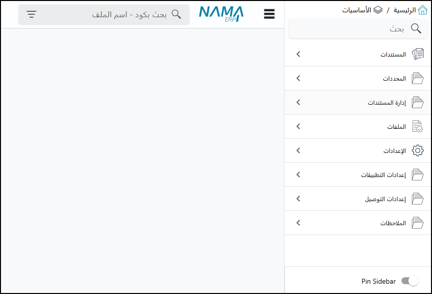

<rtl>

# مقدمة 
يوفر هذا الملف نظرة عامة على نظام نما سوفت لتخطيط موارد المؤسسات (Nama ERP)، مسلطًا الضوء على المفاهيم العامة وكيفية عمل النظام. حيث سيتم توضيح كيفية قيام المستخدم بالبحث العام والبحث المحدد في النظام، بالإضافة إلى كيفية تقسيم النظام للمعلومات إلى مستندات وملفات.
كما يتطرق إلى أهمية المحددات (مراكز التكلفة) وقدرة النظام على التعامل مع شركات متعددة وتحليل البيانات بناءً على هذه المحددات، مع توضيح مفهوم الذمم المرتبطة بالحسابات الرئيسية. ويستعرض الفيديو هذا الملف كيفية تكويد المستندات والملفات باستخدام الدفاتر والمجموعات، والتحكم في التأثير المحاسبي للمستندات من خلال التوجيهات، مع التركيز على مرونة النظام في التكيف مع احتياجات العملاء المختلفة وإمكانيات التخصيص الواسعة.
وأخيرًا، يتطرق إلى الصلاحيات وكيفية التحكم في وصول المستخدمين إلى مختلف وظائف النظام وسجل التعديلات واستعادة البيانات.

## البحث في النظام
يوجد شريط بحث علوي يمكن استخدامه للبحث في أي شاشة أو سجل في النظام، ويدعم البحث بالاسم أو الأكواد ويفهم اللغتين العربية والإنجليزية. كما يوجد بحث مشابه في القائمة الرئيسية.

## هيكلية ملفات النظام (المستندات والسجلات)
يقسم النظام البيانات إلى قسمين رئيسيين:

- المستندات: تمثل الأحداث التي تحدث مرة واحدة ولها تأثير على الأرصدة أو البيانات الموجودة، مثل فواتير المبيعات أو عروض الأسعار.

- الملفات: تمثل السجلات أو البيانات الأساسية، مثل بيانات الموظفين، العملاء، أو الموردين. هذا التقسيم يتماشى مع مفهوم في تصميم أنظمة تخطيط موارد المؤسسات (ERP) يربط بين الموارد (مثل المخزون)، والوكلاء (مثل العملاء والموظفين)، والأحداث (المستندات).

</rtl>
