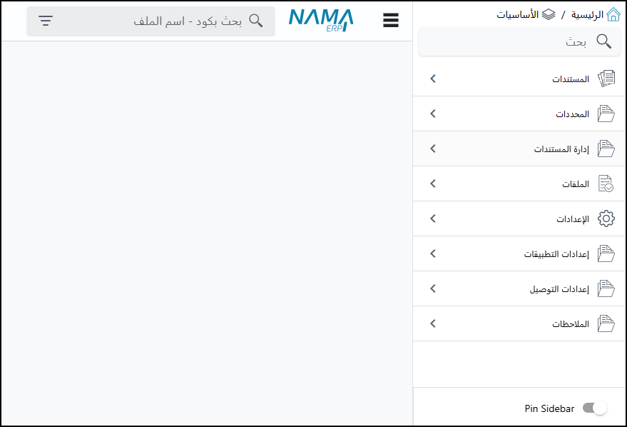
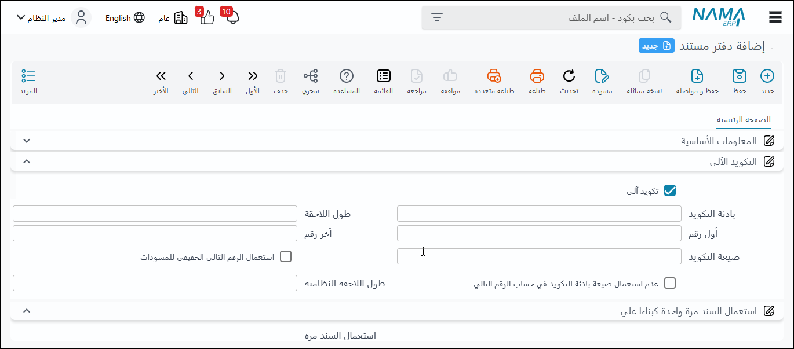
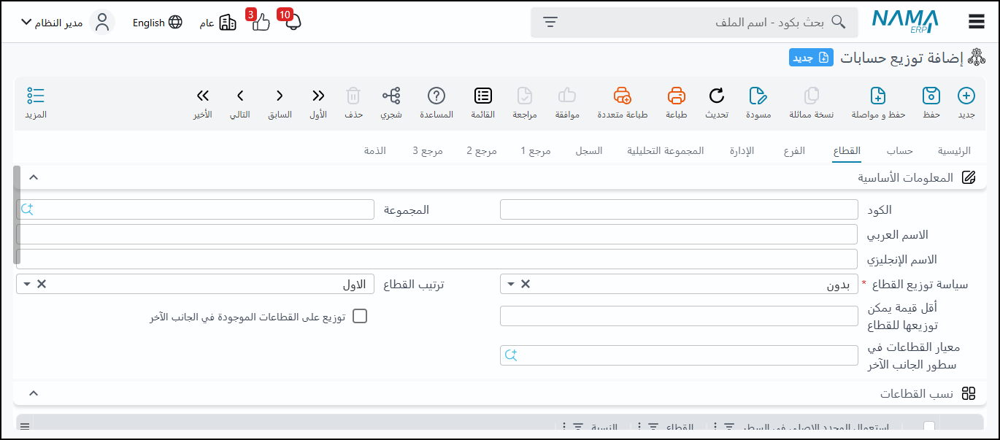
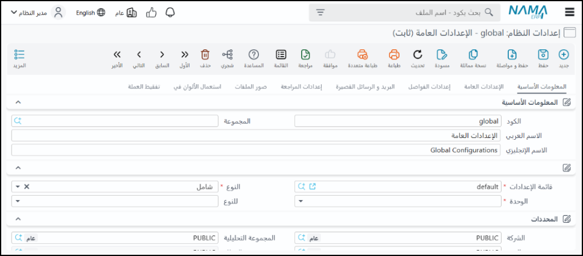
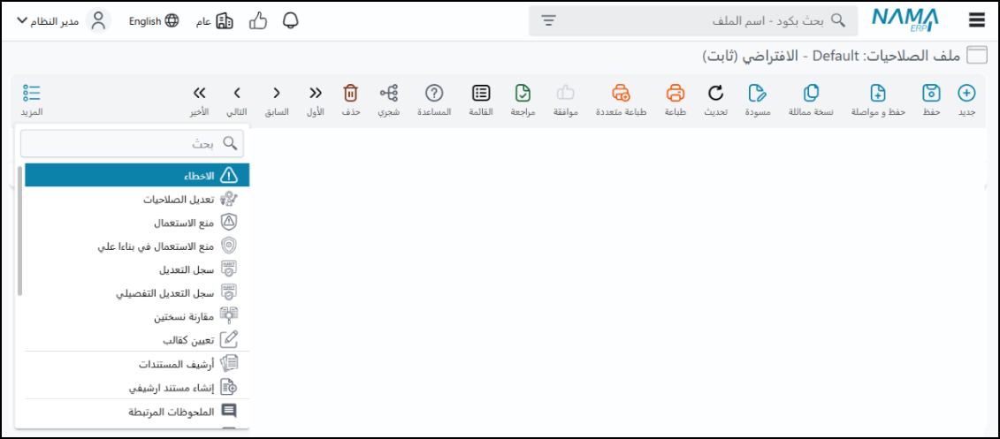
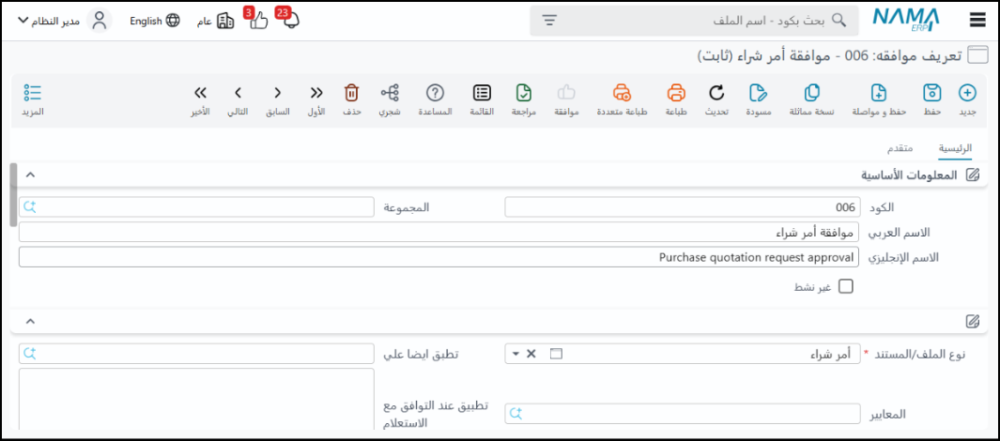

<rtl>

# مقدمة 
يوفر هذا الملف نظرة عامة على نظام نما سوفت لتخطيط موارد المؤسسات (Nama ERP)، مسلطًا الضوء على المفاهيم العامة وكيفية عمل النظام. حيث سيتم توضيح كيفية قيام المستخدم بالبحث العام والبحث المحدد في النظام، بالإضافة إلى كيفية تقسيم النظام للمعلومات إلى مستندات وملفات.
كما يتطرق إلى أهمية المحددات (مراكز التكلفة) وقدرة النظام على التعامل مع شركات متعددة وتحليل البيانات بناءً على هذه المحددات، مع توضيح مفهوم الذمم المرتبطة بالحسابات الرئيسية. ويستعرض الفيديو هذا الملف كيفية تكويد المستندات والملفات باستخدام الدفاتر والمجموعات، والتحكم في التأثير المحاسبي للمستندات من خلال التوجيهات، مع التركيز على مرونة النظام في التكيف مع احتياجات العملاء المختلفة وإمكانيات التخصيص الواسعة.
وأخيرًا، يتطرق إلى الصلاحيات وكيفية التحكم في وصول المستخدمين إلى مختلف وظائف النظام وسجل التعديلات واستعادة البيانات.

## البحث في النظام
يوجد شريط بحث علوي يمكن استخدامه للبحث في أي شاشة أو سجل في النظام، ويدعم البحث بالاسم أو الأكواد ويفهم اللغتين العربية والإنجليزية. كما يوجد بحث مشابه في القائمة الرئيسية.

## هيكلية ملفات النظام (المستندات والسجلات)
يقسم النظام البيانات إلى قسمين رئيسيين:

- المستندات: تمثل الأحداث التي تحدث مرة واحدة ولها تأثير على الأرصدة أو البيانات الموجودة، مثل فواتير المبيعات أو عروض الأسعار.

- الملفات: تمثل السجلات أو البيانات الأساسية، مثل بيانات الموظفين، العملاء، أو الموردين. هذا التقسيم يتماشى مع مفهوم في تصميم أنظمة تخطيط موارد المؤسسات (ERP) يربط بين الموارد (مثل المخزون)، والوكلاء (مثل العملاء والموظفين)، والأحداث (المستندات).

## طرق التكويد (المجموعات والدفاتر)
- المجموعات: تستخدم لتكويد السجلات (الملفات) وتسمح بعرض البيانات بشكل هرمي (شجري)، يمكن التكويد باستخدام بادئة وطول لاحقة، أو باستخدام صيغة تكويد مركبة تجمع بين حقول مختلفة في النظام باستخدام لغة "تمبو".

- الدفاتر: تستخدم لتكويد المستندات كل دفتر له رقم خاص، ويجب أن يكون مرتبطاً بشركة، ويستخدم لنوع مستند محدد أو أنواع متعددة يمكن أن يكون التكويد يدوياً أو آلياً، مع خيارات لتحديد البادئة، طول اللاحقة، الرقم الأول، وصيغة التكويد (مثلاً بناءً على السنة المالية لإعادة ترقيم اللاحقة سنوياً).
الكود النهائي للمستند يكون فريداً على مستوى الشركة ولا يمكن تكراره

## ما هي المحددات؟
المحددات: هي مفهوم يشبه مراكز التكلفة ولكن بتأثير أوسع على النظام. يوجد خمس محددات
الشركة: هي محدد رئيسي يمثل كياناً قانونياً منفصلاً النظام يدعم وجود عدة شركات تعمل معاً، والحركات بين الشركات تتم تلقائياً عبر حساب وسيط (حساب جاري الشركات). كل شركة يجب أن تكون موازنة لوحدها في ميزان المراجعة المستندات يجب أن تكون على شركة محددة، بينما بعض السجلات (مثل المستخدمين والأصناف) يمكن أن تكون "عامة" لعدة شركات صلاحيات المستخدمين مرتبطة بالشركة والفرع المعينين لهم.
محددات أخرى: أربعة محددات أخرى (قطاعات، فروع، إدارات، مجموعات تحليلية). هذه المحددات أكثر مرونة ويمكن تخصيص بند واحد في مستند لأكثر من محدد. تستخدم بشكل أساسي في التحليل والتقارير.

المحددات المركبة: تسمح بإنشاء محدد جديد (مثل مجموعة شركات) يتكون من مجموعة من المحددات الفرعية، يمكن إسناد المحدد المركب للمستخدم ليتمكن من العمل على كل الشركات المكونة للمحدد المركب.

## توزيع الحسابات (مراكز التكلفة)

يتيح النظام توزيع أرصدة الحسابات (مصروفات، إيرادات، إلخ) على المحددات الأربعة الأخرى (فروع، قطاعات، إدارات، مجموعات تحليلية) يمكن التوزيع بناءً على نسب ثابتة أو استعلامات (Query) ديناميكية تعتمد على بيانات أخرى في النظام (مثل مبيعات الفروع) كما يمكن إغلاق أرصدة حسابات وتحويلها إلى حسابات أخرى

## الذمم
بدلاً من تعريف العملاء والموردين كحسابات فرعية في شجرة الحسابات، يتعامل النظام معهم كـ "ذمم" مستقلة.
العميل، المورد، الموظف، المخزن، الشريك، وغيرها هي أمثلة على الذمم، كل ذمة (مثل العميل) يمكن ربطها بحسابات رئيسية أو فرعية متعددة في شجرة الحسابات (مثلاً حساب العملاء الرئيسي، حساب أوراق القبض) هذا يسمح بتحليل أرصدة الحسابات بناءً على تفاصيل الذمة (مثلاً تفصيل إجمالي مديونية العملاء حسب العميل، ثم الفرع، ثم أقسام الأصناف)
الخزن والبنوك كذمم: يتم التعامل مع الخزن والبنوك أيضاً كذمم مستقلة مرتبطة بحسابات النقدية والبنوك في شجرة الحسابات، مما يسمح بتتبع أرصدة كل خزينة أو بنك على حدة.
التأثير المحاسبي للمستند على حسابات الذمة يتم تحديده أيضاً في التوجيه، حيث يمكن ربط الذمة (مثل العميل) بحساب العميل الرئيسي أو حسابات أخرى معرفة في بيانات الذمة (مثل حساب أوراق القبض) هذا يسمح بتحليل أرصدة الحسابات بتفاصيل الذمم

## الإعدادات وسلوك المستند
توجد العديد من الإعدادات العامة والخاصة بأنواع المستندات والتي تتحكم في سلوكها، مثل قواعد الكميات (هل يمكن صرف كمية أكبر من أمر البيع؟)، حجز الكمية، الإنشاء التلقائي لمستندات أخرى (هل فاتورة المبيعات تنشئ سند صرف تلقائياً؟)، وغيرها، هذه الإعدادات تساهم بشكل كبير في مرونة النظام.

التحقق بناءً على معايير: يمكن تعريف قواعد مخصصة باستخدام استعلامات (كويري) للتحقق من البيانات في المستندات عند الحفظ أو المراجعة، مما يسمح بفرض شروط وقواعد عمل محددة (مثلاً، المدفوع نقداً في فاتورة مبيعات كبيرة يجب أن يمثل نسبة معينة من الإجمالي)

سجل التعديل وسلة المحذوفات: يحتفظ النظام بسجل كامل لتعديلات المستندات مع إمكانية عرض النسخ السابقة ومقارنتها والعودة لأي نسخة عند حذف مستند، فإنه ينتقل إلى سلة المحذوفات ويمكن استرجاعه.

## الصلاحيات
يتم التحكم في وصول المستخدمين للمستندات ووظائفها (إضافة، تعديل، حذف، طباعة، مراجعة) من خلال نظام صلاحيات دقيق يمكن تطبيقه على مستوى أنواع المستندات، وحتى على المستندات التي أنشأها المستخدم نفسه فقط

## نظام الموافقات
الغرض: يتيح النظام تحديد مستندات معينة تتطلب الحصول على موافقة من موظفين محددين قبل أن يصبح لها تأثير على قاعدة البيانات، فالمستند الذي ينتظر الموافقة يُعتبر كمسودة ولا يؤثر على البيانات حتى تتم الموافقة عليه.

- الإعداد والتكوين: يتم تعريف الموافقات بتحديد المستندات التي سيتم تطبيق نظام الموافقات عليها. يمكن تطبيق الموافقات على خطوة المبيعات أو أمر البيع أو مجموعة مستندات أخرى باستخدام "قائمة الأنواع" (Type List). يتم تحديد المعايير التي على أساسها تُطلب الموافقة، مثل عند التعديل، أو الحذف، أو الموافقة نفسها (في حالة سلسلة الموافقات).

- سلسلة الموافقات (Approval Workflow): يتم تحديد خطوات الموافقات وترتيبها (1، 2، 3، 4، إلخ) لكل خطوة، يتم تحديد المسؤول عن الموافقة، سواء كان موظفاً بعينه، أو مجموعة موظفين، أو ملف صلاحيات، أو مستخدم معين. يمكن أيضاً تحديد المسؤول بناءً على حقل في المستند نفسه، مثل طلب الموافقة من المدير المباشر للموظف الذي يقدم سند إجازة. 
هذا يسمح بإنشاء سلسلة موافقات تتخذ بناءً على الترتيب المحدد.

- الإشعارات (Notifications): يقوم النظام بإرسال إشعار للشخص المسؤول عن الموافقة عندما يتم تقديم طلب يتطلب موافقته. تظهر هذه الطلبات في واجهة النظام للموظف المعني، ويمكنه رؤية قائمة بجميع الموافقات المطلوبة منه وتصفيتها. يمكن أيضاً إرسال التنبيهات عبر البريد الإلكتروني (Email)، الرسائل القصيرة (SMS)، أو واتساب (WhatsApp)، هناك أيضاً خيارات تنبيه متقدمة ومستقلة يمكن تكوينها.

</rtl>
