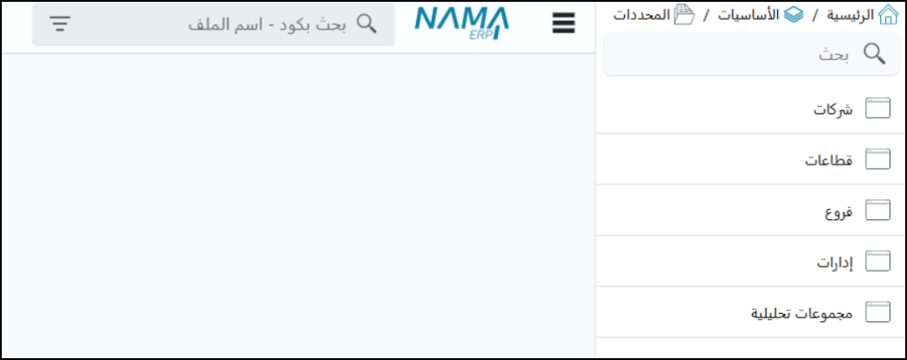
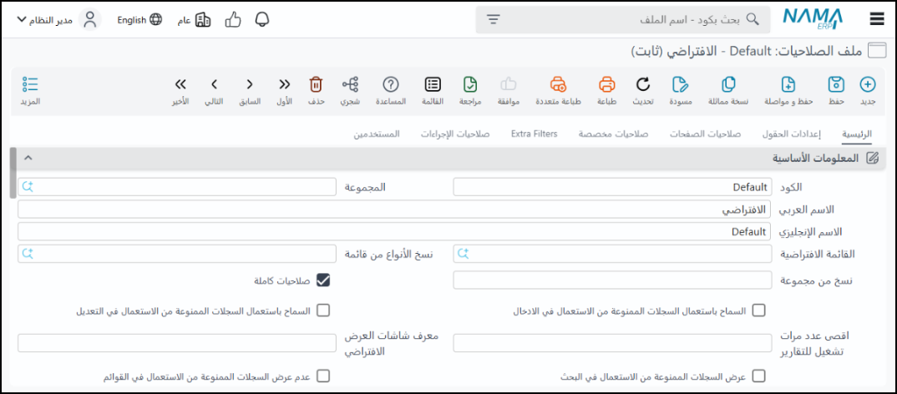
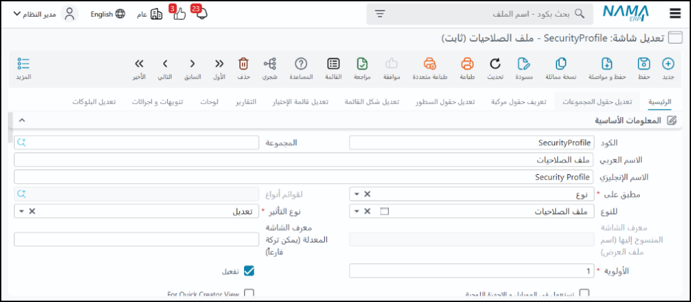

<rtl>

# مقدمة 
يوفر هذا الملف نظرة عامة على نظام نما سوفت لتخطيط موارد المؤسسات (Nama ERP)، مسلطًا الضوء على المفاهيم العامة وكيفية عمل النظام. حيث سيتم توضيح كيفية قيام المستخدم بالبحث العام والبحث المحدد في النظام، بالإضافة إلى كيفية تقسيم النظام للمعلومات إلى مستندات وملفات.
كما يتطرق إلى أهمية المحددات (مراكز التكلفة) وقدرة النظام على التعامل مع شركات متعددة وتحليل البيانات بناءً على هذه المحددات، مع توضيح مفهوم الذمم المرتبطة بالحسابات الرئيسية. ويستعرض الفيديو هذا الملف كيفية تكويد المستندات والملفات باستخدام الدفاتر والمجموعات، والتحكم في التأثير المحاسبي للمستندات من خلال التوجيهات، مع التركيز على مرونة النظام في التكيف مع احتياجات العملاء المختلفة وإمكانيات التخصيص الواسعة.
وأخيرًا، يتطرق إلى الصلاحيات وكيفية التحكم في وصول المستخدمين إلى مختلف وظائف النظام وسجل التعديلات واستعادة البيانات.

## البحث في النظام

يوفر النظام **شريط بحث علوي** يمكن استخدامه للبحث في أي شاشة أو سجل في النظام، ويدعم البحث بالاسم أو الأكواد ويفهم اللغتين العربية والإنجليزية. كما يوجد بحث مشابه في القائمة الرئيسية.

## هيكلية ملفات النظام (المستندات والسجلات)

يقسم النظام البيانات إلى قسمين رئيسيين:

- **المستندات**: تمثل الأحداث التي تحدث مرة واحدة ولها تأثير على الأرصدة أو البيانات الموجودة، مثل فواتير المبيعات أو عروض الأسعار.

- **الملفات**: تمثل السجلات أو البيانات الأساسية، مثل بيانات الموظفين، العملاء، أو الموردين. هذا التقسيم يتماشى مع مفهوم في تصميم أنظمة تخطيط موارد المؤسسات (ERP) يربط بين الموارد (مثل المخزون)، والوكلاء (مثل العملاء والموظفين)، والأحداث (المستندات).

## طرق التكويد (المجموعات والدفاتر)

- **المجموعات**: تستخدم لتكويد السجلات (الملفات) وتسمح بعرض البيانات بشكل هرمي (شجري)، يمكن التكويد باستخدام بادئة وطول لاحقة، أو باستخدام صيغة تكويد مركبة تجمع بين حقول مختلفة في النظام باستخدام لغة "تمبو".

- **الدفاتر**: تستخدم لتكويد المستندات كل دفتر له رقم خاص، ويجب أن يكون مرتبطاً بشركة، ويستخدم لنوع مستند محدد أو أنواع متعددة يمكن أن يكون التكويد يدوياً أو آلياً، مع خيارات لتحديد البادئة، طول اللاحقة، الرقم الأول، وصيغة التكويد (مثلاً بناءً على السنة المالية لإعادة ترقيم اللاحقة سنوياً).

> **ملاحظة**: الكود النهائي للمستند يكون فريداً على مستوى الشركة ولا يمكن تكراره

## ما هي المحددات؟

**المحددات**: هي مفهوم يشبه مراكز التكلفة ولكن بتأثير أوسع على النظام. يوجد خمس محددات:

### 1. الشركة
هي محدد رئيسي يمثل كياناً قانونياً منفصلاً. النظام يدعم وجود عدة شركات تعمل معاً، والحركات بين الشركات تتم تلقائياً عبر حساب وسيط (حساب جاري الشركات). كل شركة يجب أن تكون موازنة لوحدها في ميزان المراجعة. المستندات يجب أن تكون على شركة محددة، بينما بعض السجلات (مثل المستخدمين والأصناف) يمكن أن تكون "عامة" لعدة شركات. صلاحيات المستخدمين مرتبطة بالشركة والفرع المعينين لهم.

### 2. محددات أخرى
أربعة محددات أخرى (قطاعات، فروع، إدارات، مجموعات تحليلية). هذه المحددات أكثر مرونة ويمكن تخصيص بند واحد في مستند لأكثر من محدد. تستخدم بشكل أساسي في التحليل والتقارير.

### 3. المحددات المركبة
تسمح بإنشاء محدد جديد (مثل مجموعة شركات) يتكون من مجموعة من المحددات الفرعية، يمكن إسناد المحدد المركب للمستخدم ليتمكن من العمل على كل الشركات المكونة للمحدد المركب.

## توزيع الحسابات (مراكز التكلفة)

يتيح النظام توزيع أرصدة الحسابات (مصروفات، إيرادات، إلخ) على المحددات الأربعة الأخرى (فروع، قطاعات، إدارات، مجموعات تحليلية). يمكن التوزيع بناءً على:

- **نسب ثابتة** 
- **استعلامات (Query) ديناميكية** تعتمد على بيانات أخرى في النظام (مثل مبيعات الفروع)

كما يمكن إغلاق أرصدة حسابات وتحويلها إلى حسابات أخرى.

## الذمم

بدلاً من تعريف العملاء والموردين كحسابات فرعية في شجرة الحسابات، يتعامل النظام معهم كـ **"ذمم"** مستقلة.

**أمثلة على الذمم**: العميل، المورد، الموظف، المخزن، الشريك، وغيرها. كل ذمة (مثل العميل) يمكن ربطها بحسابات رئيسية أو فرعية متعددة في شجرة الحسابات (مثلاً حساب العملاء الرئيسي، حساب أوراق القبض). هذا يسمح بتحليل أرصدة الحسابات بناءً على تفاصيل الذمة (مثلاً تفصيل إجمالي مديونية العملاء حسب العميل، ثم الفرع، ثم أقسام الأصناف).

**الخزن والبنوك كذمم**: يتم التعامل مع الخزن والبنوك أيضاً كذمم مستقلة مرتبطة بحسابات النقدية والبنوك في شجرة الحسابات، مما يسمح بتتبع أرصدة كل خزينة أو بنك على حدة.

التأثير المحاسبي للمستند على حسابات الذمة يتم تحديده أيضاً في التوجيه، حيث يمكن ربط الذمة (مثل العميل) بحساب العميل الرئيسي أو حسابات أخرى معرفة في بيانات الذمة (مثل حساب أوراق القبض). هذا يسمح بتحليل أرصدة الحسابات بتفاصيل الذمم.

## الإعدادات وسلوك المستند
توجد العديد من الإعدادات العامة والخاصة بأنواع المستندات والتي تتحكم في سلوكها، مثل قواعد الكميات (هل يمكن صرف كمية أكبر من أمر البيع؟)، حجز الكمية، الإنشاء التلقائي لمستندات أخرى (هل فاتورة المبيعات تنشئ سند صرف تلقائياً؟)، وغيرها، هذه الإعدادات تساهم بشكل كبير في مرونة النظام.

التحقق بناءً على معايير: يمكن تعريف قواعد مخصصة باستخدام استعلامات (كويري) للتحقق من البيانات في المستندات عند الحفظ أو المراجعة، مما يسمح بفرض شروط وقواعد عمل محددة (مثلاً، المدفوع نقداً في فاتورة مبيعات كبيرة يجب أن يمثل نسبة معينة من الإجمالي)

سجل التعديل وسلة المحذوفات: يحتفظ النظام بسجل كامل لتعديلات المستندات مع إمكانية عرض النسخ السابقة ومقارنتها والعودة لأي نسخة عند حذف مستند، فإنه ينتقل إلى سلة المحذوفات ويمكن استرجاعه.

## الصلاحيات

يتم التحكم في وصول المستخدمين للمستندات ووظائفها (إضافة، تعديل، حذف، طباعة، مراجعة) من خلال **نظام صلاحيات دقيق** يمكن تطبيقه على مستوى أنواع المستندات، وحتى على المستندات التي أنشأها المستخدم نفسه فقط.

## نظام الموافقات

**الغرض**: يتيح النظام تحديد مستندات معينة تتطلب الحصول على موافقة من موظفين محددين قبل أن يصبح لها تأثير على قاعدة البيانات، فالمستند الذي ينتظر الموافقة يُعتبر كمسودة ولا يؤثر على البيانات حتى تتم الموافقة عليه.

### الإعداد والتكوين
يتم تعريف الموافقات بتحديد المستندات التي سيتم تطبيق نظام الموافقات عليها. يمكن تطبيق الموافقات على خطوة المبيعات أو أمر البيع أو مجموعة مستندات أخرى باستخدام **"قائمة الأنواع"** (Type List). يتم تحديد المعايير التي على أساسها تُطلب الموافقة، مثل عند التعديل، أو الحذف، أو الموافقة نفسها (في حالة سلسلة الموافقات).

### سلسلة الموافقات (Approval Workflow)
يتم تحديد خطوات الموافقات وترتيبها (1، 2، 3، 4، إلخ). لكل خطوة، يتم تحديد المسؤول عن الموافقة، سواء كان موظفاً بعينه، أو مجموعة موظفين، أو ملف صلاحيات، أو مستخدم معين. يمكن أيضاً تحديد المسؤول بناءً على حقل في المستند نفسه، مثل طلب الموافقة من المدير المباشر للموظف الذي يقدم سند إجازة.

هذا يسمح بإنشاء سلسلة موافقات تتخذ بناءً على الترتيب المحدد.

### الإشعارات (Notifications)
يقوم النظام بإرسال إشعار للشخص المسؤول عن الموافقة عندما يتم تقديم طلب يتطلب موافقته. تظهر هذه الطلبات في واجهة النظام للموظف المعني، ويمكنه رؤية قائمة بجميع الموافقات المطلوبة منه وتصفيتها.

**قنوات الإرسال**: يمكن أيضاً إرسال التنبيهات عبر البريد الإلكتروني (Email)، الرسائل القصيرة (SMS)، أو واتساب (WhatsApp)، هناك أيضاً خيارات تنبيه متقدمة ومستقلة يمكن تكوينها.

### أنواع الموافقات المتقدمة
يدعم النظام **الموافقات المتوازية**، حيث يمكن لأكثر من شخص الموافقة على نفس المستند في نفس الوقت، أو يمكن لكل شخص الموافقة على جزء معين يخصه.

**مثال**: في مستندات سلسلة التوريد (Supply Chain) يمكن لمدير كل قسم (مثل قسم الشاشات أو الأجهزة المنزلية) الموافقة على السطور المتعلقة بقسمه في أمر الشراء.

### إجراءات الموافق (Approver Actions)
يمكن للموافق اتخاذ عدة قرارات بخلاف الموافقة أو الرفض:

- **تصعيد (Escalate)**: الطلب لموظف آخر محدد ليأخذ القرار بدلاً منه
- **إرجاع (Return)**: للخطوة السابقة لمراجعته مرة أخرى
- **إعادة من البداية (Restart)**: لإلغاء جميع الموافقات السابقة وبدء العملية من جديد

### ميزات الأمان (Security Features)
يمكن تفعيل استخدام **رمز تحقق لمرة واحدة (OTP)** عند الموافقة، مما يضيف طبقة أمان إضافية ويضمن أن الموافقة تتم من قبل الشخص المعني مباشرة، حتى لو كان يستخدم مساعداً (سكرتير) لإدخال البيانات.

## التنبيهات

**الغرض**: تختلف عن الموافقات في أنها رد فعل على إجراء يقوم به المستخدم على مستند أو ملف في النظام.

### المحفزات (Triggers)
يتم إرسال التنبيه عند وقوع حدث معين قام به المستخدم، مثل حفظ مستند جديد، تعديل مستند، أو حذف مستند، يمكن تحديد تنبيهات لحقل معين يتغير في المستند.

### المستلمون (Recipients)
يمكن إرسال التنبيهات لموظفين محددين داخل الشركة أو حتى لجهات خارجية مثل العملاء أو الموردين.

### قنوات الإرسال (Delivery Channels)
يمكن إرسال التنبيهات كإشعار داخل النظام، أو عبر البريد الإلكتروني، أو واتساب، أو الرسائل القصيرة. يمكن استخدامها لإرسال نماذج طباعة أو فواتير بصيغة PDF أو روابط للعملاء.

## المهام المجدولة

**الغرض**: تسمح للنظام بأداء إجراءات معينة تلقائياً في أوقات محددة دون الحاجة لتدخل المستخدم، وهي إجراءات يبدأها النظام بنفسه وليست رد فعل على فعل مستخدم.

### الأمثلة والوظائف
تتضمن أمثلة على المهام المجدولة ما يلي:

- **إرسال تنبيهات تذكيرية** للموظفين إذا لم يتخذوا إجراءً على مهمة معينة (مثل خيط بيع) خلال فترة محددة، وتصعيد التنبيه للمدير إذا استمر عدم اتخاذ الإجراء

- **إرسال تقارير تلقائياً** بالبريد الإلكتروني، مثل رصيد الخزائن يومياً، أو الرصيد الختامي للشهر عند بدايته

- **التنبيه عند وجود نواقص** في الأصناف ووصولها إلى حد إعادة الطلب، مع إمكانية توفير زر في البريد الإلكتروني لإنشاء أمر شراء مباشرة

- **إنشاء مستندات تلقائياً**، مثل قيد استحقاق الإيجار في بداية كل شهر

- **التنبيه على انتهاء صلاحية** جوازات السفر أو الإقامات للموظفين

- **إرسال تنبيهات بالدفعات المستحقة** للعملاء للمتابعة والتحصيل

- **قراءة أوامر البيع الجديدة** من مواقع التجارة الإلكترونية (مثل Magento , Shopify, Salla, Zid) بشكل دوري

- **تشغيل وطباعة تقارير معينة**، مثل تقرير الأصناف التالفة لكل أمين مخزن بشكل أسبوعي

- **تكرار وإنشاء نسخ** من مستندات موجودة بشكل دوري

- **ربط النظام مع ماكينات الحضور والانصراف** وقراءة بيانات الحضور وإعادة حسابها تلقائياً بشكل دوري

### التكوين
يتم تحديد الأوقات التي ستعمل فيها المهمة المجدولة والإجراء الذي ستقوم به تلقائياً.

## تعديل الشاشات

الغرض: يتيح للمستخدمين تعديل شكل الشاشات في النظام بالكامل ليناسب احتياجاتهم.
◦ أنواع العرض (Views): يمكن تعديل ثلاثة أشكال رئيسية لأي شاشة: عرض القائمة (List View)، شاشة التعديل/الإضافة (Edit View)، وشاشة البحث (Search View).

◦ إمكانيات التعديل: يمكن إضافة صفحات جديدة، حذف صفحات، حذف أو إضافة حقول، حذف أو إضافة أزرار، كما يمكن إعادة ترتيب المجموعات (Groups) والحقول داخلها، تغيير عناوين الحقول والمجموعات، ويمكن التحكم في عرض الحقول في الجداول (Grids) وارتفاع الجداول نفسها.

### الأدوات المساعدة
تتوفر ميزة **السحب والإفلات (Drag and Drop)** لتسهيل إعادة ترتيب العناصر وتغيير حجمها في الشاشة، كما توجد أداة (باستخدام **Alt+Ctrl+I**) لعرض معلومات الحقل (Field Info)، مثل اسمه البرمجي في قاعدة البيانات ونوعه والجدول الذي ينتمي إليه، لمساعدة المستخدمين (خاصة مديري النظام والمطبقين) في فهم أصل البيانات وتعديل الشاشات أو إنشاء التقارير.

### إضافة عناصر خارجية
يمكن إضافة تقارير معينة داخل شاشة مستند (مثل عرض كشف حساب العميل داخل فاتورة المبيعات) لتسهيل الوصول إليها دون الحاجة لفتح شاشة ان بشكل منفصل، كما يمكن ربط هذه التقارير ببيانات المستند الحالي (مثل أخذ كود العميل من فاتورة المبيعات لتصفية كشف الحساب). يمكن أيضاً إضافة **لوحات معلومات (Dashboards)** داخل الشاشات.

### إضافة أزرار مخصصة
يمكن إضافة أزرار مخصصة في شاشات التعديل أو في عرض القائمة (لتطبيق الإجراء على مجموعة مستندات مختارة). يمكن لهذه الأزرار تشغيل إجراءات معينة مثل إرسال تنبيه (كمثال على نوع التنبيه اليدوي). يمكن ربط الأزرار بمسارات عمل معينة **(Entity Flow)** لإنشاء مستندات بناءً على مستندات أخرى (مثل إنشاء أمر بيع من عرض سعر).

## أداة إنشاء التقارير

**الغرض**: تمكن المستخدمين، حتى لو لم يكن لديهم معرفة بلغة **الاستعلامات (SQL)**، من إنشاء تقارير مخصصة بسهولة وسرعة، هذه الأداة بديل للطرق التقليدية التي تتطلب معرفة برمجية وأدوات تصميم مثل **Jasper Reports** أو **Crystal Reports**.

### خطوات الإنشاء
يختار المستخدم **الشاشة** التي سيبني التقرير عليها (مثل فاتورة المبيعات). ثم يحدد **الحقول** التي يريد عرضها في التقرير (مثل الكود، التاريخ، العميل). يمكن للمستخدمين اختيار الحقول من قائمة تعرض جميع الحقول المتاحة في الشاشة المختارة.

### تحديد المعايير (Parameters)
يمكن للمستخدم تحديد معايير لتصفية البيانات في التقرير، مثل تصفية حسب عميل معين أو نطاق تاريخ.

### مساعدة في التعرف على الحقول
تساعد أداة معلومات الحقل (**Alt+Ctrl+I**) المستخدم في التعرف على الأسماء البرمجية للحقول لتسهيل اختيارها عند بناء التقرير.

### الاستخدام
بعد إنشاء التقرير، يمكن لأي مستخدم لديه الصلاحية تشغيله. يمكن عرض البيانات وطباعتها وتجميعها **(Grouping)**.

### الفوائد
- **تسرع عملية إنشاء التقارير** بشكل كبير (من ساعات إلى دقائق)
- **تمكن المستخدمين العاديين**، وخاصة مديري النظام، من إنشاء تقارير معقدة بأنفسهم

</rtl>
