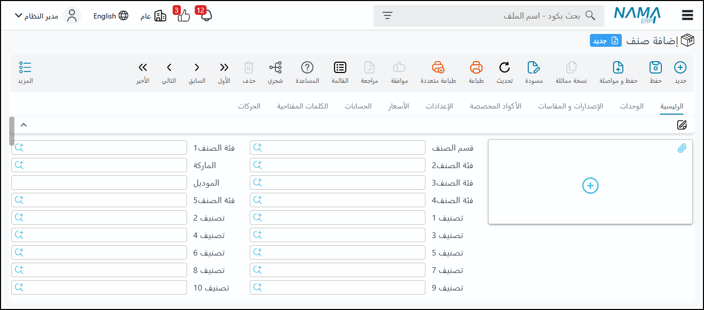

<rtl>

  # مقدمة
يعتبر نظام المخزون في نما سوفت الركيزة الأساسية لأي عمل تجاري يسعى لتحقيق الكفاءة التشغيلية والربحية المثلى. فإدارة المخزون ليست مجرد عملية تسجيل للكميات الموجودة في المستودعات، بل هي فن وعلم يضمن توفر المنتجات المناسبة بالكميات الصحيحة وفي الوقت المحدد، مع تقليل التكاليف وزيادة رضا العملاء.
في بيئة الأعمال المتغيرة اليوم، حيث تتسارع وتيرة سلاسل الإمداد وتزداد تعقيدات الطلب، يصبح امتلاك نظام قوي لإدارة المخزون ضرورة لا غنى عنها. يهدف نظام المخزون في نما سوفت إلى تزويد الشركات بأداة شاملة تمكنها من التحكم الكامل في دورة حياة المخزون بأكملها؛ بدءًا من لحظة استلام المواد الخام أو المنتجات، مرورًا بعمليات التخزين والصرف، وصولًا إلى تتبع المنتجات المباعة وتحليل أدائها.
من خلال هذا النظام، ستتمكن من تحقيق رؤية واضحة وفورية لحالة مخزونك، مما يتيح لك اتخاذ قرارات مستنيرة بشأن الشراء، التسعير، وإدارة الطلبات. سواء كنت تدير مستودعًا واحدًا أو شبكة معقدة من المستودعات، فإن نظام نما سوفت مصمم لتبسيط العمليات، تقليل الهدر، وتحسين التدفق النقدي، ليصبح شريكك الاستراتيجي في بناء مستقبل أكثر استقرارًا ونموًا لأعمالك.

## الأصناف

شاشات الأصناف هي جزء أساسي في أي نظام نظرًا لكثرة تفاصيلها.

### تصنيفات الأصناف (Item Categories & Classes):

-الفئات (Categories): يوجد 5 فئات رئيسية (فئة 1، فئة 2، فئة 3، فئة 4، فئة 5). هذه الفئات موجودة في ملف واحد داخل النظام، ويمكن للمستخدمين تغيير أسمائها وربطها ببعضها. تم تطوير هذا التصنيف في البداية (حوالي 2011/2012)، ولكن تم تطوير بدائل لتلبية متطلبات أوسع.
    
-تصنيفات الأصناف (Item Classes): يوجد من 1 إلى 10 تصنيفات (Item Classes). هذه التصنيفات هي ملفات منفصلة في النظام، وكل ملف عبارة عن A و B. يمكن ربطها ببعضها البعض لتشكل هيكلًا شجريًا (كأنها شجرة)، حيث يتبع كل تصنيف تصنيفًا أبًا
    
-استخدامات التصنيفات: تحتوي هذه التصنيفات على بيانات افتراضية وبيانات تفصيلية تُستخدم في التقارير والعديد من العمليات الأخرى، بما في ذلك المعلومات المتعلقة بالإرسال الضريبي الإلكتروني.
    
-تصنيفات إضافية: بالإضافة إلى الفئات والتصنيفات، يمكن استخدام "قسم صنف" و"ماركة" (براند) لتصنيف الأصناف. تُستخدم كل هذه التصنيفات للفلترة في التقارير وللتكويد التلقائي للأصناف.
    
### التكويد التلقائي للأصناف

يوفر النظام طريقة مرنة لتكويد الأصناف تلقائيًا.

• صيغة حساب الكود:
-يمكن تحديد صيغة الكود التلقائي باستخدام أي حقل متاح من التصنيفات، مثل Item Class 1.Code أو Item Class 2.Code2.
    
-يمكن إضافة فواصل (مثل الشرطات) أو أي نص آخر بين الحقول.
    
-يمكن تضمين كود القسم (Section Code) في صيغة الكود.
    
• اللاحقة (Suffix): يمكن تحديد طول اللاحقة (Suffix) للكود، فمثلاً إذا كان الطول 3، سيتم إضافة 001, 002 حتى 9993.

• كود بديل: يمكن إضافة كود بديل اختياري للصنف.

• نقطة البداية: يمكن تحديد رقم البدء للكود (مثل 05 أو 100) بدلاً من البدء من 001.

• صيغة الاسم:
-يمكن إنشاء صيغة لاسم الصنف باللغتين العربية والإنجليزية، بالاعتماد على أسماء التصنيفات أو الأوصاف أو الملاحظات.
    
-هذا يضمن أسماء متسقة للأصناف، على سبيل المثال، يمكن لنظام عميل يعمل في مجال الإنترلوك والبردورة أن يقوم بتوليد اسم الصنف بناءً على خصائصه مثل الجهد والأبعاد والمواد، مما يقلل من الأخطاء الكتابية ويسهل البحث.

    
• التكويد بناءً على معايير:

-يمكن تحديد طريقة التكويد بناءً على شروط محددة (معايير)، مثل "عندما تكون الفئة كذا، افعل كذا" أو "عندما يكون التصنيف 1 كذا، قم بتكويد الصنف بطريقة مختلفة".
    
-إذا لم يتحقق الشرط، فإن النظام لا يرفض التكويد، بل يختار الكود من الرأس (Header).
    
-التحقق بناءً على معايير (Validation based on Criteria): يختلف هذا عن التكويد الشرطي؛ حيث يمكن للنظام رفض حفظ الصنف إذا لم يستوفِ شروطًا معينة، مثل "إذا كان الكود يبدأ بكذا، فيجب أن يحتوي الاسم على كذا".

    
### أنواع وخصائص الأصناف

تتعدد أنواع وخصائص الأصناف في النظام لتناسب الاحتياجات المختلفة.

-أنواع الأصناف (Item Types):
صنف مجمع (Assembled Item): صنف حقيقي يدخل ويخرج من المخزن، ويمكن عمل سندات تجميع له.
    
صنف مخزني (Stocked Item): صنف حقيقي يدخل ويخرج من المخزن.
    
خدمة (Service Item): ليس صنفًا حقيقيًا، ويُضاف كبند إضافي في الفواتير. في طرق الشراء، يمكن السماح بتوزيع تكلفته أو سعره على باقي الأصناف بمعايير محددة.
    
-المورد الافتراضي (Default Vendor): يُستخدم لتحديد المورد المفضل عند الشراء.

-المرفقات والصور (Attachments and Images): إمكانية إضافة مرفقات وصور للصنف.

-الشحنات (Shipments): تُستخدم للأصناف ذات تاريخ صلاحية (مثل الأدوية والمنتجات الغذائية). عند الشراء، يتم تحديد الشحنة وتاريخ الصلاحية، ويتم متابعة الكميات والتكاليف لكل شحنة أو دفعة.

• الأرقام المسلسلة (Serial Numbers):
تُستخدم لمتابعة كل قطعة بشكل فردي.
يجب أن يتطابق عدد الأرقام المسلسلة مع الكمية المشتراة.
عند البيع، يجب البيع من الأرقام المسلسلة التي تم توريدها.
لا يمكن شراء رقم مسلسل مرتين، ولا يمكن بيعه مرتين إلا إذا تم إرجاعه.

    
### خصائص الأصناف (Item Attributes):

خصائص تُعرف عند الشراء أو التوريد: مثل الشحنة، الرقم المسلسل، الصندوق، والنسبة الفعالة وغير الفعالة (المرتبطة بالتصنيع).
    
### خصائص تُعرف في ملف الصنف:

-المقاسات (Sizes): مثل (Large, Small, Medium) للملابس. يتم متابعة الكميات بناءً على المقاس عند الشراء والبيع.
        
-الإصدارات (Versions): مثل (إصدار 2025، إصدار 2024)، أو (فرزة أولى، فرزة ثانية). يمكن أن تكون نفس الصنف بفرزات مختلفة. قد يعتبرها بعض العملاء أصنافًا منفصلة بينما يفضل آخرون اعتبارها خصائص لنفس الصنف.
        
-الألوان (Colors): عادة لا يتم متابعة الكميات بناءً على اللون بنفس دقة المقاسات.
        
 مفهوم الخصائص: تتيح هذه الخصائص التفريق بين الأصناف المتشابهة دون الحاجة لتعريف كل اختلاف كصنف جديد، مع إمكانية متابعة الكميات بشكل دقيق مع الحفاظ على التكاليف موحدة (باستثناء سعر البيع للفرزات مثلاً).
    
### إدارة المخزون والتقارير

يقدم النظام أدوات لمتابعة المخزون وإعداد التقارير.

• السحب على المكشوف (Overdraft): يسمح النظام بالسحب على المكشوف، ويمكن تفعيل أو تعطيل هذه الميزة لكل صنف على حدة، الافتراضي هو تعطيلها.

• أعمار المخزون (Inventory Aging):
يشبه أعمار الديون ولكنه خاص بالخامات والأصناف.
    
يوجد تقرير يوضح مدة بقاء الكميات في المخزون (مثلاً 100 قطعة منذ سنتين مقابل 100 قطعة منذ أسبوع).
    
يساعد هذا التقرير في تخطيط المشتريات، حيث يمكن للمستخدمين معرفة متى يجب عليهم شراء المزيد من صنف معين بناءً على عمر المخزون الحالي.
    
• مواصفات الصنف (Item Specifications): يمكن إدخال معلومات وصفية مثل الوزن والحجم والمساحة والكثافة.

• معلومات التخطيط (MRP Information): تتضمن فترة الشراء (Purchase Lead Time) وفترة التصنيع (Manufacturing Lead Time) وطريقة حساب المخزون، وسيتم مناقشة تفاصيلها في جزء تخطيط موارد التصنيع (MRP).

• وحدة التسعير (Pricing Module):
يوجد موديول لتسعير الأصناف تلقائيًا عند الشراء.
    
يأخذ سعر الشراء ويطبق عليه معادلات لإنتاج سعر البيع.
    
يحتوي على ملف إعدادات يحدد كيفية أخذ الأرقام وتطبيق المعادلات وإنشاء قوائم أسعار البيع.

    
### الوحدات (Units of Measure)

يتيح النظام متابعة الأصناف بوحدات قياس مختلفة.

• وحدات القياس المتعددة: يمكن تعريف وحدات مختلفة مثل "قطعة" (Piece)، "صندوق" (Box)، "كرتونة" (Carton).

• أسعار افتراضية: يمكن تحديد أسعار افتراضية، حد أدنى للسعر، حد أقصى للسعر، الربحية، وأقل كمية للبيع (مهمة في المبيعات).

• معاملات التحويل (Conversion Factors):

يجب تحديد معامل التحويل بين كل وحدة وأخرى، على سبيل المثال: "1 صندوق يساوي 10 قطع".
    
يُنصح دائمًا بتحديد الأرقام بالوحدة الأصغر لتجنب مشاكل التقريب وزيادة دقة التقارير والتكاليف.
    
• وحدات التقرير (Reporting Units): يمكن تسمية وحدات تقرير 1 ووحدة تقرير 2 (مثلاً "قطعة" و"صندوق") لتمكين إظهار الأرقام في التقارير بوحدات مختلفة (الوحدة الأساسية، أو وحدات التقرير المحددة، أو وحدة البيع، أو وحدة الشراء).

• وحدتان للصنف الواحد (Dual Units):
في بعض الأعمال، قد يتطلب الأمر متابعة الصنف بوحدتين مختلفتين في نفس الوقت.
    
    ◦ أمثلة:
        ▪ الذهب: يُتابع بالقطعة والوزن (مثلاً 15 قطعة ذهب بوزن مختلف).
        ▪ الحيوانات: مثل الخرفان، تُتابع بالرأس والوزن.
        ▪ كراتين اللحوم: تُتابع بالعدد والوزن (لأن وزن الكرتونة الواحدة غير ثابت).
        
يقوم النظام بمتابعة الكمية بالوحدتين معًا، ويمكن إدخال وتتبع الكميات بالعدد والوزن عند التوريد والصرف والجرد.

    
### التشكيلة (Assortment)

مفهوم "التشكيلة" يُستخدم للأصناف التي تُباع بمجموعات ثابتة.

• المفهوم: تعني أن الصنف يأتي في تشكيلة ثابتة من الأحجام أو الأنواع. مثال: حقيبة سفر تأتي بثلاثة أحجام (كبيرة، متوسطة، صغيرة) معًا داخل بعضها البعض. مثال آخر: كرتونة أحذية تحتوي على تشكيلة ثابتة من المقاسات (مثلاً 5 من مقاس 40، 2 من مقاس 42، وهكذا).

• قابلية التخصيص: يمكن للعميل أن يطلب من المصنع تغيير تشكيلة الأحجام أو الأنواع حسب احتياجاته.

### التنقل في نقاط البيع (POS Navigation)

تُستخدم تصنيفات الأصناف لتسهيل التنقل داخل شاشات نقاط البيع (POS).

• يمكن تنظيم الأصناف بشكل هرمي (مثلاً: مشروبات > مشروبات ساخنة > قهوة، شاي) مما يتيح للمستخدم الوصول السريع إلى الأصناف المطلوبة في نقاط البيع

تعريف الصنف وخصائصه الأساسية

عند تعريف أي صنف في النظام، يمكنك تحديد عدة خصائص لتمكينه من تمثيل تشكيلة واسعة من المنتجات بكفاءة:

الفئات والأقسام والعلامات التجارية والموديلات:

    ◦ تُستخدم هذه التصنيفات لتكويد الأصناف وتسميتها وتنظيمها.
    
    ◦ يمكن للصنف الواحد أن ينتمي إلى فئة وقسم وعلامة تجارية وموديل محدد.
    
• تنوعات الصنف (الألوان، المقاسات، الإصدارات):

    ◦ يمكّن النظام من تعريف صنف واحد يمثل العديد من التنوعات.
    
    ◦ على سبيل المثال، بلوزة واحدة يمكن أن تتوفر بثلاثة ألوان وخمسة مقاسات، مما يعني أنها تمثل 15 صنفًا فعليًا.
    
    ◦ يمكن إضافة إصدارات مختلفة لنفس الصنف (مثلاً: بلوزة بكم أو بنص كم)، مما يضاعف عدد التنوعات (مثلاً: 15 × 2 = 30 تنوعًا لصنف واحد).
    
    ◦ تعتبر هذه الخصائص (الألوان، المقاسات، الإصدارات) أصنافًا مختلفة داخل النظام عند تتبعها.
    
• أرقام الدفعات (الباتشات):

    ◦ يمكن استخدام أرقام الدفعات لتتبع الأصناف التي يتم تصنيعها أو استلامها في أوقات مختلفة (مثلاً: دفعة شهر يناير، دفعة شهر فبراير).
    
    ◦ تتيح هذه الميزة تتبع كل دفعة على حدة وتحديد خصائصها بشكل مستقل، مما يزيد من دقة التتبع.

### تتبع الأصناف بمعرفات فريدة

بالإضافة إلى التنوعات، يمكن تتبع الأصناف بمعرفات فريدة لضمان تحكم أكبر:

• الأرقام التسلسلية (السيريال نمبرز):

تُستخدم بشكل أساسي في الأجهزة الإلكترونية (مثل أجهزة الآيفون) حيث يكون لكل قطعة رقم تسلسلي فريد.

تُعد الأرقام التسلسلية ضرورية لتتبع التفاصيل المرتبطة بالقطعة، مثل سداد الجمارك أو ضمان صحة المرتجعات.

يمكن أن يحتوي الصنف على رقم تسلسلي واحد أو رقمين تسلسليين (مثل السيريال نمبر وIMEI للموبايلات).
    
السيريال نمبر يصف قطعة من نفس الصنف، وليس صنفًا مختلفًا.
    
• الصناديق/العبوات:

ميزة مشابهة للشحنات ولكن بدون تواريخ إنتاج.

تُستخدم في الغالب لقطع غيار السيارات التي تأتي في صناديق مرقمة، مما يتيح تتبع القطعة المعيبة وتحديد الصندوق الذي وصلت فيه للمورد.

### خصائص الصنف المتقدمة

يقدم النظام خصائص إضافية لدعم عمليات معقدة، خاصة في التصنيع:

-النسبة الفعالة والنسبة غير الفعالة:

ترتبطان بشكل وثيق بعمليات التصنيع، خاصة عند استخدام خامات ذات نسب فعالية متغيرة (مثل خامات الأسمدة أو الأدوية).

تُحدد النسبة الفعالة (مثلاً 60% أو 80%) كمية المادة الفعالة في الخامة.
    
إذا كانت النسبة الفعالة 50% وتحتاج إلى كيلو واحد من المادة الفعالة، سيتطلب ذلك صرف 2 كيلو من الخامة.
    
النسبة غير الفعالة هي عكس النسبة الفعالة وتُستخدم في معادلات تصنيع مختلفة، خاصة لتحديد كميات المواد الأخرى التي تكمل الوزن المطلوب.
    
• الأكواد المخصصة:

لا يقتصر الصنف على كود واحد؛ بل يمكن أن يكون له كود أساسي وكود بديل.
    
يمكن تعريف أكواد باللغتين العربية والإنجليزية للصنف نفسه، ولوحداته، ولإصداراته، ومقاساته، وألوانه.
    
عند إدخال كود خاص بإصدار أو لون أو مقاس، يقوم النظام تلقائيًا بجلب الصنف مع تفاصيل اللون والمقاس والإصدار والوحدة.
    
• وحدات الصنف والباركود:

يمكن للصنف أن يحتوي على وحدات متعددة (مثلاً: قطعة، علبة، كرتونة) مع تحديد معدلات التحويل بينها.

لكل وحدة باركود خاص بها (مثلاً: باركود للقطعة، وآخر للعلبة، وثالث للكرتونة).
    
عند مسح باركود أي وحدة، يقوم النظام تلقائيًا بتسجيل الوحدة المناسبة.

    
• أكواد العملاء والموردين:

يتيح لك النظام تسجيل الأكواد التي يستخدمها عملاؤك أو موردوك لنفس الصنف.

هذا يسهل عملية استلام أوامر الشراء أو طلبات عروض الأسعار من العملاء والموردين مباشرةً باستخدام أكوادهم.

### إعدادات سياسات الصنف

تتيح لك إعدادات الصنف التحكم في كيفية التعامل مع كل صنف:

• التحكم في البيع والشراء والإرجاع:

يمكن تحديد ما إذا كان الصنف قابلًا للبيع، أو الشراء، أو الإرجاع.

على سبيل المثال، قد تكون الملابس الداخلية وملابس السباحة غير قابلة للإرجاع بمجرد شرائها.
    
• سياسة السحب والاستلام (إجباري، اختياري، ممنوع):
تُطبق هذه السياسات على خصائص الصنف المختلفة مثل الإصدار، المقاس، اللون، الشحنة، النسبة الفعالة، الرقم التسلسلي، الصندوق.

سياسة السحب (الصرف من المخزن/البيع): تحدد ما إذا كان إدخال خاصية معينة (مثل الرقم التسلسلي) إلزاميًا، اختياريًا، أو ممنوعًا عند صرف الصنف.

سياسة الاستلام (التوريد للمخزن/الشراء): تحدد نفس الأمر عند استلام الصنف.

مثال: قد يكون الرقم التسلسلي إجباريًا عند البيع (للتأكد من مطابقة المرتجعات لما تم بيعه)، واختياريًا عند الشراء (لأن مصدر الشراء قد لا يكون مهمًا في تتبع الرقم التسلسلي).

إذا كانت الخاصية اختيارية عند الاستلام، فلن تتمكن من تتبع الكمية أو التكلفة عليها.

### متابعة الكميات والتكاليف

تعتبر متابعة الكميات والتكاليف من أهم الإعدادات التي تؤثر على دقة بيانات المخزون والربحية:

• أهمية متابعة الكميات:
تتيح لك معرفة الكمية المتوفرة من كل تنوع محدد للصنف (مثلاً: كمية الباتش الفلاني، كمية الصندوق الفلاني، كمية اللون أو المقاس المحدد).

تمنع صرف كميات أكبر مما هو متاح من تنوع معين (مثلاً: إذا وردت 5 قطع صفراء و 2 خضراء، لا يمكنك صرف 6 قطع صفراء).
    
تؤثر على الجداول النظامية في السيستم وتمنع السحب على المكشوف على مستوى الخصائص المختارة.
    
• متابعة التكاليف (المتوسط المرجح):

يمكن تمكين متابعة التكاليف فقط إذا تم تمكين متابعة الكميات للخاصية المعنية.

تساعد في تتبع تكلفة كل دفعة أو إصدار بشكل مستقل، خاصة في التصنيع حيث قد تختلف تكلفة الإنتاج بين الدفعات بسبب عوامل مثل أعطال الآلات أو انقطاع الكهرباء.
    
إذا قمت بإنتاج دفعة بتكلفة عالية بسبب مشكلة، فإن تتبع تكلفتها بشكل منفصل يمنعها من التأثير سلبًا على متوسط ربحية الدفعات الأخرى.
    
• تأثير خيارات المتابعة على حساب التكلفة:

    ◦ افتراضيًا، يتم تتبع متوسط التكلفة على مستوى الشركة والصنف فقط.

إذا قمت بتفعيل تتبع التكلفة على خصائص إضافية (مثل الإصدارات، المقاسات، الدفعات):
    
        ▪ عند شراء 10 قطع من الإصدار "أ" بسعر 10، و 10 قطع من الإصدار "ب" بسعر 20، فإن بيع القطع من الإصدار "أ" سيُحسب بتكلفة 10، ومن الإصدار "ب" بتكلفة 20. لن يتم حساب متوسط التكلفة بين الإصدارين.
        ▪ إذا اشتريت 10 قطع من الإصدار "أ" بسعر 10، ثم 10 قطع أخرى من نفس الإصدار "أ" بسعر 20، فإن متوسط التكلفة سيُحسب لهما (15)، لأن النظام يجمع جميع الحركات التي تخص نفس الصنف ونفس الإصدار.

        
يعمل النظام على تصفية الحركات بناءً على جميع الخصائص التي اخترت تتبع الكمية والتكلفة عليها (الشركة، الصنف، اللون، المقاس، المخزن، إلخ).

• متابعة التكاليف على مستوى المخزن والقطاع:

بالإضافة إلى خصائص الصنف، يمكن تتبع الكميات والتكاليف على مستويات تنظيمية أخرى مثل القطاع، الفرع، الإدارة، أو المجموعة التحليلية، وحتى على مستوى المخزن نفسه.

هذا يسمح لكل مخزن أو قطاع بأن يكون له متوسط تكلفته الخاص به، مستقلًا عن المخازن أو القطاعات الأخرى.

• قرارات لا يمكن التراجع عنها:
هام جدًا: بمجرد حدوث أي حركة (توريد أو صرف) على الصنف، لا يمكن تغيير إعدادات متابعة الكميات أو التكاليف لهذا الصنف.

هذا القرار يجب أن يتم اتخاذه في بداية العمل بالنظام، حيث إن أي تغيير لاحق سيتطلب معالجة خاصة من فريق الدعم الفني لتصحيح البيانات التاريخية.

### تعديل الحركات بعد إجرائها

يمتلك النظام ميزة فريدة تسمح بتعديل الحركات القديمة وتأثيرها على التكاليف:

• إمكانية التعديل:
يمكنك تعديل فواتير المشتريات القديمة (مثل تغيير سعر الوحدة) حتى بعد مرور شهور أو بيع الأصناف المرتبطة بها.

شرط أن تكون السنة المالية مفتوحة، وأن يكون لديك الصلاحية للتعديل.

• تأثير التعديل على التكاليف:

إذا قمت بتعديل سعر شراء صنف تم بيعه أو تصنيعه لاحقًا، سيقوم النظام تلقائيًا بإعادة حساب متوسط التكلفة لجميع الحركات اللاحقة (عمليات الصرف، تكلفة البضاعة المباعة، تكلفة توريد التصنيع).

هذا يضمن أن تكون تقاريرك المالية دقيقة، حتى لو تم اكتشاف الأخطاء بعد فترة طويلة.

• لماذا يسمح النظام بذلك؟

الهدف الأساسي من هذه الميزة هو القدرة على تصحيح الأخطاء التي قد يرتكبها المستخدمون في إدخال البيانات (مثل إدخال سعر أو كمية خاطئة).

رغم أنها قد تستخدم لأغراض أخرى (مثل التلاعب الضريبي)، فإن النظام يوفر الأداة بناءً على طلب العملاء لمرونة تصحيح الأخطاء التشغيلية.

افتراضيًا، النظام يمنع التعديل على الحركات القديمة، لكن يمكن تفعيل هذا الخيار بناءً على طلب العميل.

### إعدادات إضافية للصنف

توجد إعدادات أخرى تساهم في إدارة الصنف بشكل فعال:

• فحص الجودة:
إعدادات مرتبطة بفحص جودة الأصناف، والتي سيتم تناولها بتفصيل عند الحديث عن فحص الجودة.

• القيم الافتراضية للتقارير:

أقل كمية: الكمية التي عند الوصول إليها يجب طلب المزيد من الصنف (خاص بالشراء وتخطيط الموارد).

أقصى كمية: الكمية القصوى التي يجب ألا يتجاوزها المخزون (تستخدم لمنع الشراء الزائد).
    
حد الطلب: نقطة إعادة الطلب، مرتبطة بتخطيط متطلبات المواد (MRP).
    
التكلفة القياسية: تستخدم لحساب تكلفة الأصناف التي تم توريدها ولم يتم ربطها بفاتورة شراء بعد.
    
أقل سعر بيع: لمنع بيع الصنف بأقل من سعر محدد.
    
فترة الركود: لتحديد فترة عدم نشاط الصنف في التقارير.
    
يمكن تطبيق هذه الإعدادات على مستويات مختلفة (فرع، شركة، إلخ) لأغراض التقارير.

    
• التسعير وقوائم الأسعار والخصومات:
يمكن تعريف أسعار افتراضية، وأقل سعر، وأقصى سعر لكل وحدة.

يدعم النظام قوائم أسعار متعددة يمكن تطبيقها على عميل معين، أو مجموعة عملاء، أو لفترة زمنية محددة (مثلاً: قائمة أسعار لرمضان).

يسمح النظام بتعريف خصومات على مستوى الصنف، وعروض خاصة، وأصناف مجانية كجزء من عروض البيع.

• الحسابات:

تستخدم لتصنيف الصنف كجزء من أصول الشركة (مثلاً: خزينة).

• الكلمات المفتاحية (الكي ووردز):

تُعد بمثابة "بطاقات" (Tags) للصنف، تساعد في البحث الديناميكي وتصنيف الأصناف بشكل مرن (مثلاً: "حذاء أطفالي"، "بلوزة").

تتيح لك البحث عن الأصناف بناءً على كلمات وصفية إضافية تتجاوز التصنيفات الهيكلية.

</rtl>
